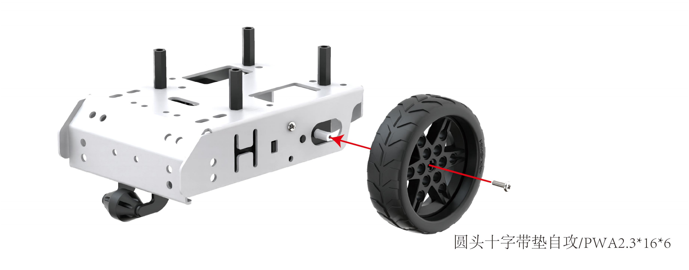
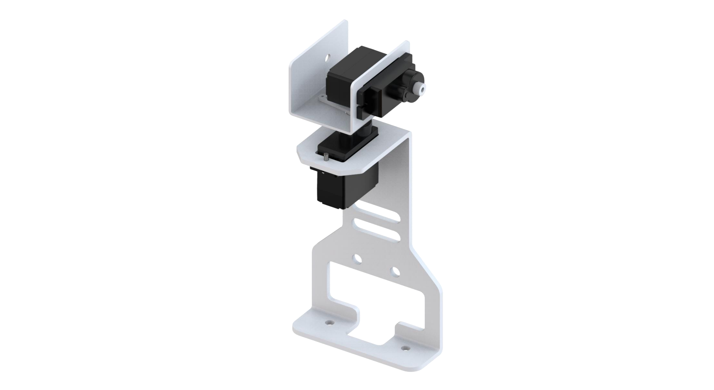
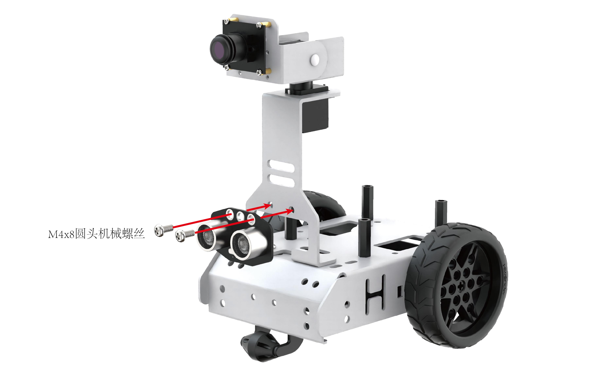

# 学前先看

## 1. 认识GoGoPi

### 1.1 产品简介

GoGoPi是一款基于树莓派的智能视觉小车，搭载2个自由度云台和高清晰度摄像头，配合OpenCV能实现颜色追踪、人脸追踪、手指识别等功能。

GoGoPi搭载RGB发光超声波，可控制灯光变化，实现智能避障，此外还支持拓展多种传感器，能实现多种感知的融合。

为了降低学习门槛，同时我们还为您准备了大量的学习资料和相关的软件，并将玩法程序全部开源，大家按照下方学习的顺序进行即可。

### 1.2 产品清单

### 1.3 镜像烧录方法

购买了无卡无主板套餐的用户可按照如下步骤进行镜像烧录。

1.  准备工具：准备一台电脑，一个读卡器，一个内存大于16G的SD卡。

2.  解压镜像包：资料包中的镜像文件为压缩文件，需要解压到没有中文路径的地方，解压后得到后缀为img的镜像文件。

3.  SD卡初始化工具安装：将SD卡放入读卡器，与电脑相连，前往"3.常用小工具"-\>1.SD卡初始化工具"文件夹，双击下图所示SD卡格式化工具安装包，完成格式化工具的安装。

4.  打开安装好的SD卡格式化工具（SD Card Formatter），如下图所示选择要烧入镜像的SD内存卡，在"Volume label"标签下填入名称"boot"，然后单击右下角"Format"按钮。在弹出的提醒框依次单击"是"，"确定"，等待格式化完成。

5.  格式化完成后，在"3.常用小工具-\>2.镜像烧录工具"文件夹，双击"Win32DiskImager.exe"文件。

6.  在弹出的页面中单击文件夹图标的按钮，在弹出的页面中找到镜像文件的位置，选择镜像文件，然后单击文件夹右边的倒三角，选择要烧录的SD卡卷标。

7.  以上配置完成后，点击"Write"按钮开始烧录，此时会弹出一个确认框，单击"Yes"继续下一步。（若报错，有可能是镜像文件路径中有中文，需要把其修改到没有中文的路径下。）

8.  此时界面上会显示出烧录进度，等烧录完成后，会弹窗提示"Write Successful"。单击"OK"，此时烧录工具状态栏也会有Done的字样，关闭所有软件即完成镜像烧录。

烧录完成，若提示是否格式化，请直接关闭！

## 2. 动手组装

### 2.1 舵机中位教程（必看）

【视频】

### 2.2 组装步骤

- #### Step 1

- #### Step 2

- #### Step 3

- #### Step 4

- #### Step 5

- #### Step 6

- #### Step 7

- #### Step 8

- #### Step 9

- #### Step 10

- #### Step 11

- #### Step 12

- #### Step 13

- #### Step 14

- #### Step 15

- #### Step 16

- #### Step 17

- #### Step 18

- #### Step 19

- #### Step 20

- #### Step 21

- #### Step 22

- #### Step 23

- #### Step 24

- #### Step 25

- #### Step 26

- #### Step 27

- #### Step 28

- #### Step 29

- #### Step 30

- #### Step 31

- #### Step 32

- #### Step 33

- #### Step 34

- #### Step 35

- #### Step 36

- #### Step 37

- #### Step 38

- #### Step 39

- #### Step 40

- #### Step 41

- #### Step 42

- #### Step 43

- #### Step 44

- #### Step 45

- #### Step 46

- #### Step 47

- #### Step 48

- #### Step 49

- #### Step 50

- #### Step 51

- #### Step 52

### 2.3 接线教程

- #### 超声波传感器接线

用4Pin线一端连接到超声波传感器的接口，如下图所示：

另一端连接树莓派扩展板上的任意一个IIC接口（SCL SDA GND 5V），如下图所示：

- #### 电机接线

首先我们先看下电机的左右位置分布，如下图所示：

将上图左电机接入树莓派拓展板上的M1接口，右电机接入树莓派拓展板上的M2接口，如下图所示：

:::{Note}
电机反接会造成小车运动轨迹相反。
:::

- #### 舵机接线

首先我们先看下舵机的位置分布，如下图所示：

将上图1号舵机接入树莓派拓展板上的1号舵机接口，2号舵机接入树莓派拓展板上的2号舵机接口（黄色舵机线接S，红色接5V，棕色接-），如下图所示：

:::{Note}
请严格按照上方描述进行连接，请勿反接。
:::

- #### 摄像头接线

首先我们将摄像头USB线的白色端口连接到摄像头（此处设置了防反插设计，切勿硬塞。），如下图所示：

将摄像头的另一端连接到树莓派扩展板上任意一个USB接口，如下图所示：

- #### 电池连接

将电池盒的供电线连接扩展版的DC插头并打开电池盒的开关（OFF是关闭，ON是打开）

## 3. 首次开机

### 3.1 充电及电池对接

由于运输途中电池不能充满，所以在初次开机前，建议先给电池充满电，以下是具体充电方法：

1)  拿出电池充电器，将两节18650的电池（选配）按照正负极对应（正对正，负对负）装到电池充电器中，注意！电池正负极切勿装反！再通过数据线将电池充电器（选配）和充电头（5V 3A，需自备）进行连接，最后连接电源。

2)  等待充电完成（适配器指示灯在未通电的状态下为绿色，通电后为红色代表充电中（充电时长约为5个小时左右）、指示灯由红色变为绿色代表充电完成），充电完成后，请尽快拔掉充电器，切勿一直充电。

3)  安装电池前请确保电池盒的开关拨到"**OFF**"档。

4)  充电完成后，将电池插进电池盒。（正极对正极，负极对负极）

5. 将电池盒的供电线连接扩展版的DC插头并打开电池盒的开关（OFF是关闭，ON是打开）

:::{admonition} 锂电池使用规范
1)  请使用套件附带的专用充电器。电池充电盒在不接电池的情况下连接电源，充电指示灯会变为绿色。
2)  接上电源情况下连接电池，指示灯为红色表示充电中，当指示灯由红色变为绿色代表充电完成。充电完成后应及时拔掉充电线及开关，避免过充损坏电池。
3)  在机器人使用前需要先将电池进行对接。对接时，正极对应正极，负极对应负极。
4)  如若长时间不使用机器人，请先将电池充满，然后断开机器人与电池之间的DC插头连接线。拔对接线切勿直接用力拉扯，避免损坏接口。
5)  电池储存远离请高温和各类液体，防止引起过热、起火或受潮导致功能衰退、寿命减小。
:::

### 3.2 开关机

1)  将电池盒的开关拨到"**ON**"档，再将树莓派扩展板的开关由"**OFF**"推动到"**ON**"，此时树莓派的LED1、LED2常亮，稍等片刻后LED2由常亮变为每隔1秒闪亮一次、云台回到初始姿态、蜂鸣器发出"嘀"的一声，即设备成功开机。

树莓派本身也是电脑，开机启动需要一小段时间，开机时间约30秒左右，请耐心等待
    

设备开机成功后，默认为AP直连模式，并产生一个以HW开头的热点。

接下来您可前往"[上手试玩]()"继续学习后续内容。
