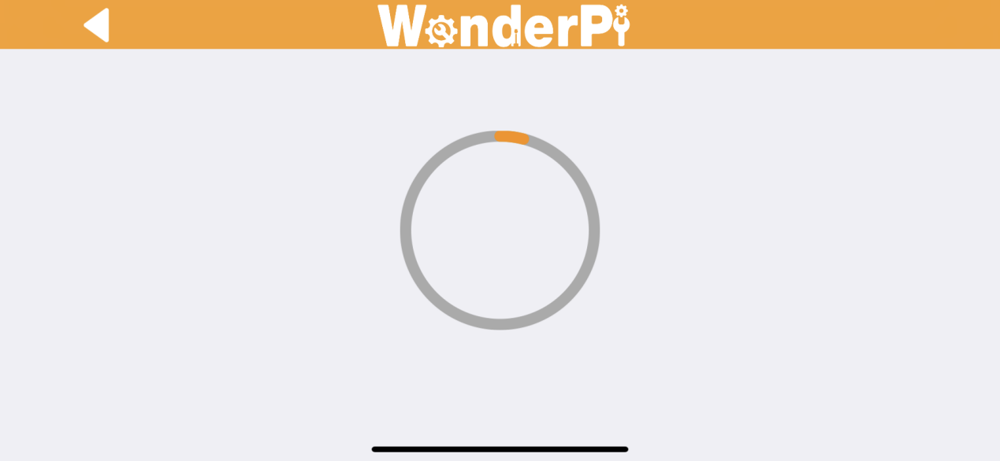
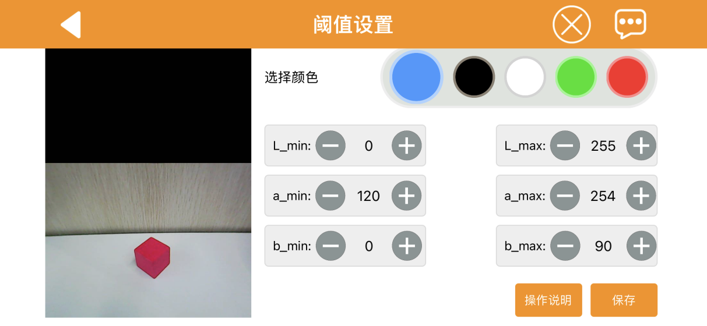
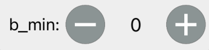
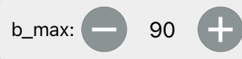
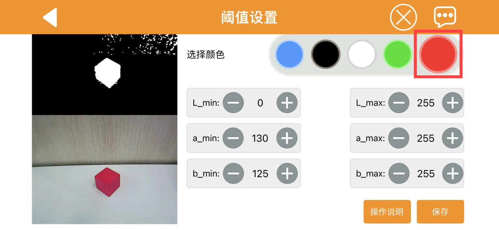
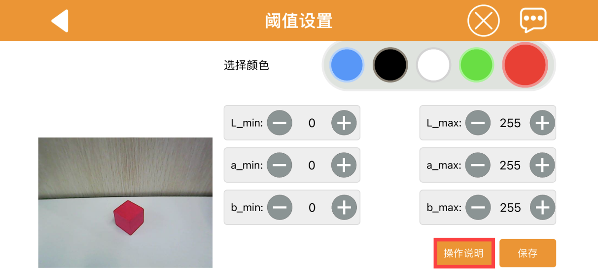
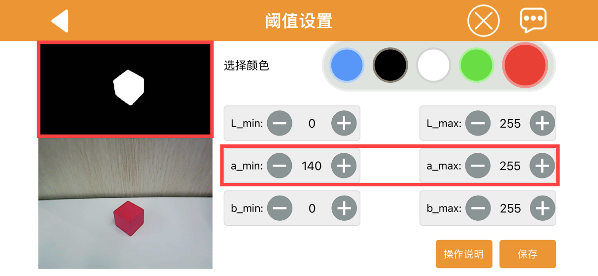

# 上手试玩

## 1. 手机APP安装和连接

- **安装时请对APP开放所有权限，以免影响APP的正常使用。**

- **打开APP前，需开启手机的GPS定位和Wi-Fi功能。**

### 1.1 APP安装

**[安卓系统](https://play.google.com/store/apps/details?id=com.Wonder.Pi)**

**[iOS系统](https://apps.apple.com/cn/app/wonderpi/id1477946178)**

:::{Note}
- 连接前，请将GoGoPi开机。
- 打开APP前，需开启手机的GPS定位和Wi-Fi功能。
- 本节文档以安卓系统为例，操作方法同样适用于iOS系统。
:::

### 1.2 设备连接

机器人在开机成功后默认会产生一个以"**HW**"开头的热点，使用手机APP连接到这个热点后，便能启动其它玩法。

### 1.3 连接模式简介

以下为机器人的两种网络模式：

1.  AP 直连模式：开发板能够开启热点被手机连接上。(但不能联通外部网络)

2.  STA局域网模式：开发板能够主动去连接指定的热点/Wi-Fi。(可联通外部网络)

局域网模式不能和直连模式共存，机器人默认为AP 直连模式，用户无论是选择AP直连还是STA局域网模式，玩法功能都一致。

**这里建议用户先学习直连模式配置方法进行体验，局域网模式可根据需求来选看。**

- #### 直连模式连接方法（必看）

1)  打开手机APP，在主界面选择"GoGoPi"，然后点击下方图示右下角的"+"按钮，选择"**直连模式**"。

2)  接下来按照画面提示，前往手机设置连接"HW"名开头的热点。

3)  连接完成后，返回手机APP。手机APP将自动连接设备，稍等片刻，等待搜索到下图所示的机器人图标时即代表成功连接。

:::{Note}
若手机弹窗提示"网络不可用，是否继续连接"之类的弹窗，单击"保持连接"即可。
:::

- #### 局域网模式连接方法（选看）

1. 断开之前机器人直连模式下的热点，打开WonderPi，然后单击右下角"**+**"按钮，选择"**局域网模式**"，根据界面提示前往手机设置连接Wi-Fi。

2. 点击想要连接的Wi-Fi（这里以"LH"为例）。

3. 连接完成后返回APP，APP会提示输入你所连接Wi-Fi的密码（若没有自动弹出可再次点击"局域网模式"），输入完成点击"**下一步**"。（请确认Wi-Fi密码是否输入正确，如果输入错误会导致连接失败。）

4. 根据APP提示，再次前往设置，连接"HW"开头的热点。

5. 连接后HW开头的热点后返回APP，此时可以看到APP已经开始自动连接了。连接过程中如出现是否加入的提示，点击"**加入**"即可。

6. 稍等片刻，界面会自动切回APP主界面，同时树莓派扩展板上的LED1将停止闪烁，和LED2同样保持常亮状态，此时即表示树莓派联网成功。

7. 长按APP中的机器人图标，可以查看分配给机器人的IP地址和ID。

## 2. 手机APP试玩

### 2.1 准备工作

参照上节"**1. 手机APP安装与连接**"教程，安装手机APP，并连接**GoGoPi**智能视觉小车。

### 2.2 开始试玩

1)  点击机器人图标，进入玩法选择的主界面。

2)  我们可以看到机器人中的全部玩法。点击你想要的玩法，画面会出现提示"玩法切换成功！"即为成功启动玩法。例如我们点击"机体遥控"，画面如下所示：

3)  在这个玩法里，左侧按钮可以用来控制GoGoPi云台的转动角度，中间是当前的实时画面，右侧是控制小车运动的按钮。

**每次启动该玩法，GoGoPi云台便会自动回中。**

4)  用手指轻触手机屏幕，会显示下图所示的手机APP界面点击按钮，即可对当前实时画面进行拍照，照片可返回连接时的主界面，按下"**Photo**"按钮查看。

在本节教程里我们不对玩法做详细说明，大家可前往"第8章 AI视觉项目课程-\>第4课颜色追踪"文件夹内参考对应教程。

其余玩法各可参考下表 ：

| 序号 | 玩法名 | 实现效果 |
|:--:|:--:|:--:|
| 1 | 颜色追踪 | 可实时监测指定颜色的物体，当物体移动后，小车也将跟随进行移动。 |
| 2 | 人脸跟踪 | 不仅可以实现人脸检测，还可以对视觉范围内的人脸进行智能跟随移动。 |
| 3 | 手指识别 | 识别视觉范围内出现的手指个数，同时小车将根据识别不同的手指数量，执行不同的动作。并将结果显示在APP上。（为了更好的效果，最好视觉范围内只出现单只手掌） |
| 4 | 自动避障 | 小车超声波将检测前方物体距离，并进行转弯。 |

## 3. 颜色阈值调试

在不同光源下，物体颜色的呈现效果是不同的，而这一现象会对涉及颜色识别的功能玩法产生一定程度的影响。针对这一问题，本节课会学习如何使用手机APP"WonderPi"来调节颜色阈值。

### 3.1 准备工作

将机器人开机，安装手机APP"**WonderPi**"并连接机器人。如需了解具体操作步骤，可查看目录"**[1. 手机APP安装与连接](#anchor_1)**"下的教程。

### 3.2 界面介绍

进入玩法模式选择界面后，点击下图所示按键，即可进入颜色阈值调节界面。

下表是颜色阈值调节界面的功能说明：

<table class="docutils-nobg" border="1">
<tbody>
<tr>
<th  style="text-align: center;"><strong>图标</strong></th>
<th style="text-align: center;"><strong>功能说明</strong></th>
</tr>
<tr>
<td ></td>
<td >
摄像头回传画面的处理后图像。

图像中，颜色物体区域表示为白色，其余部分表现为黑色。
</td>
</tr>
<tr>
<td ></td>
<td >摄像头回传画面的原始图像。</td>
</tr>
<tr>
<td ></td>
<td >选择当前调节的颜色。</td>
</tr>
<tr>
<td ></td>
<td >
调节回传画面的L分量（白~黑）范围，"L_min"是范围下限，"L_max"是范围上限。

点击按键可减小对应数值，点击按键可增大数值。
</td>
</tr>
<tr>
<td ></td>
<td >
调节回传画面的A分量（绿~红）范围，"a_min"是范围下限，"a_max"是范围上限。

点击按键可减小对应数值，点击按键可增大数值。
</td>
</tr>
<tr>
<td ></td>
<td >
调节回传画面的B分量（黄~蓝）范围，"b_min"是范围下限，"b_max"是范围上限。

点击按键可减小对应数值，点击按键可增大数值。
</td>
</tr>
<tr>
<td ></td>
<td >打开操作说明窗口，可查看颜色阈值调节方法。</td>
</tr>
<tr>
<td ></td>
<td >保存调节的阈值。</td>
</tr>
<tr>
<td ></td>
<td >返回玩法模式选择界面。</td>
</tr>
<tr>
<td ></td>
<td >隐藏导航栏。</td>
</tr>
<tr>
<td ></td>
<td >显示幻尔科技的信息窗口。</td>
</tr>
</tbody>
</table>

### 3.3 调节颜色阈值

1.  进入颜色阈值调节界面，选择需要调节阈值的颜色，此处以红色为例。

2.  将红色物体放置在摄像头的视野范围内，将L、A、B分量的最小值都调为"**0**"，最大值都调为"**255**"。

3.  点击"**操作说明**"按键，查看颜色阈值的调节方法。

:::{Note}
如需关闭操作说明窗口，点击"好的"即可。
:::

4.  由LAB颜色空间分布图可知，红色靠近"**+a**"，即需要优先调整A分量。

5.  "**a_max**"的数值保持不变，增大"**a_min**"的数值，直至处理后图像中的红色物体区域显示为白色，其余部分显示为黑色。

6.  根据所处环境来调整L分量和B分量。若红色物体在环境下颜色偏浅，增大亮度的最小值(**L_min**)；在环境下颜色偏深，则减小亮度的最大值(**L_max**)。若红色物体在环境下偏暖色调，增大色度的最小值(**b_min**)；在环境下偏冷色调，减小色度的最大值(**b_max**)。

7.  完成阈值调节后，点击"**保存**"按键，保存调节好的阈值范围。

