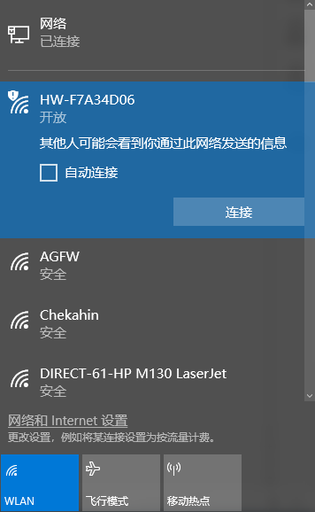
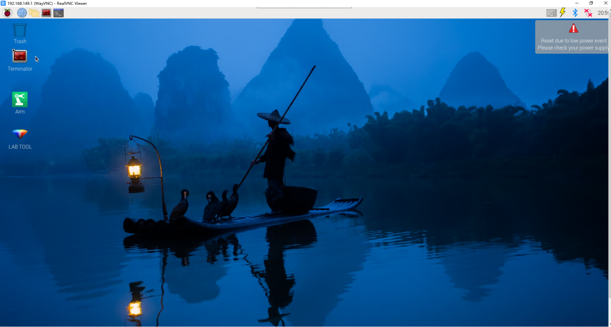
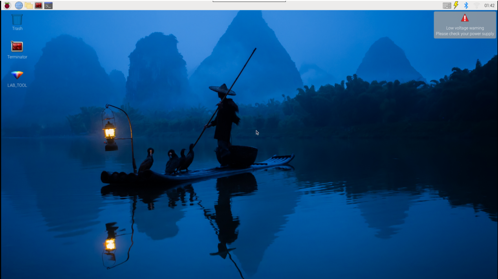
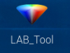
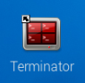
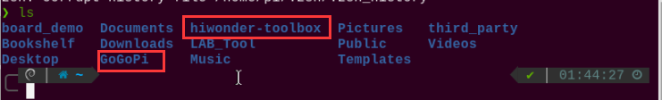
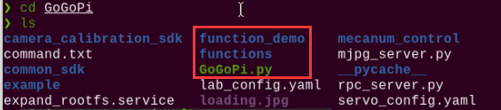

# 远程工具安装及连接

本章节的学习需要准备一台笔记本电脑，如使用台式电脑请自备无线网卡。

## 1. 准备工作

### 1.1 VNC远程工具的安装

如果你希望通过电脑端来执行玩法，并尝试后期查看玩法代码并修改程序，那么需要先完成本章的学习，安装好VNC软件。

VNC是一款图形化远程控制软件。我们可以通过连接树莓派的Wi-Fi热点，直接在自己电脑上控制树莓派。接下来将会分步讲解如何使用VNC。

1)  双击"**2 软件工具\3.远程连接工具\2.VNC（可视化桌面工具）**"文件夹中的"**VNC-Viewer-6.17.731-Windows**"文件，在弹出的对话框中选择安装语言为"**English**"，单击"**OK**"按钮。


2)  在弹出的界面单击"**Next**"按钮。


3)  在新的提示框中勾选同意协议，然后单击"**Next"，接着弹出安装位置设置，保持默认设置，继续单击"**Next**"。


4)  在新弹出的页面中单击"**Install**"。


5)  等待安装，片刻之后出现安装完成提示页面，单击"**Finish**"按钮即可完成安装，安装后打开VNC。


6)  VNC完成连接，直接打开图标即可。

### 1.2 设备开机

按照前面所学，在连接适配器后推动树莓派扩展板的开关。稍等片刻后树莓派扩展板上的LED1由常亮变为每隔2秒闪烁一次，同时手掌上的所有舵机呈现抓取姿态，即为成功开机标志。

## 2. 设备连接

1)  机器人在开机后，会产生一个HW开头的热点，我们可以打开电脑Wi-Fi搜索到以HW开头的热点，如下图所示：



2)  在打开的VNC Viewer中输入树莓派默认的IP地址：192.168.149.1，然后按回车，如果提示不是安全连接的话单击"**Continue**"。


3. 此时弹出一个提示框，要求输入账号（Username）和密码（Password），账号输入：pi，密码输入：raspberrypi，勾选上记住密码框，然后单击"OK"，此时即可看到远程打开的树莓派的桌面了。




4. 在桌面上有一个警告对话框（树莓派本身特性），单击"**确定**"关闭即可。（如果是黑屏，只有一个鼠标，则可尝试重新启动树莓派。）

:::{Note}
各实验玩法详细启动步骤请参考随后的每章节的课程学习。
:::

## 3. 系统目录简要说明

### 3.1 桌面分布

通过VNC远程连接后，树莓派系统桌面如下图所示：



其中我们主要看下面这三个：

：颜色模型参数调节工具。

：Terminator终端，用于输入指令进行操作。

：文件管理器，可视化文件目录界面。（推荐对指令行了解较少的初学者使用）

### 3.2 程序结构说明

:::{Note}
指令的输入需严格区分大小写及空格，关键词支持"**TAB**"键补齐。
:::

1)  单击图标。输入"**ls**"指令，然后按下回车，列出当前所有文件。主要来看这三个目录，如下图所示：



|    **目录名**    |            **作用**            |
|:----------------:|:------------------------------:|
|      GoGoPi      | 存放所有玩法及涉及到的程序源码 |
| hiwonder-toolbox |         Wi-Fi管理工具          |

:::{Note}
AI视觉玩法只需了解"GoGoPi"这个文件夹即可。
:::

2)  接下来进入玩法及程序源码目录，输入指令，列出该目录下的所有文件夹及文件。在GoGoPi内我们主要了解以下三个目录，如下图所示：

```commandline
cd GoGoPi
```

```commandline
ls
```



|       **目录名**        |            **目录作用**            |
|:-----------------------:|:----------------------------------:|
| Functions&function_demo |       AI视觉玩法程序所在目录       |
|        GoGoPi.py        | 主程序，处理玩法调用（已设置自启） |

3)  最后我们再依次输入指令，了解一下程序所对应的玩法：

```commandline
cd function_demo
```

```commandline
ls
```

|            **程序名**             | **对应玩法** |
|:---------------------------------:|:------------:|
|           face_demo.py            | 人脸位置识别 |
|       individual_colors.py        | 单个颜色识别 |
| Target_location_identification.py | 人脸位置识别 |

```commandline
cd functions
```

```commandline
ls
```

|    **程序名**     | **对应玩法** |
|:-----------------:|:------------:|
|   avoidance.py    |   智能避障   |
| color_tracking.py |   颜色追踪   |
| face_tracking.py  |   人脸跟踪   |
| finger_detect.py  |   手指识别   |

