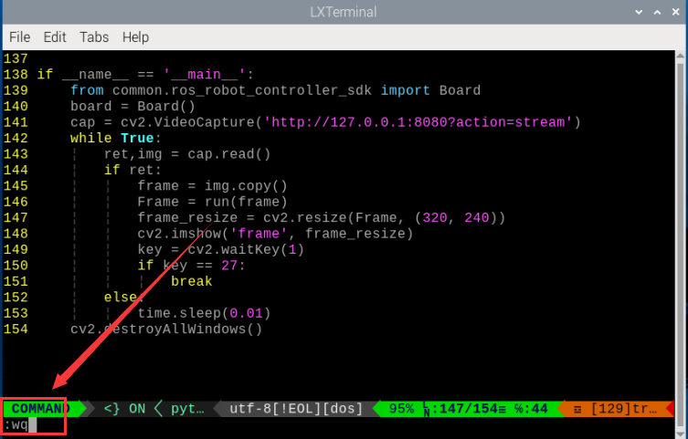
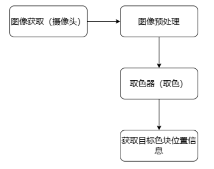
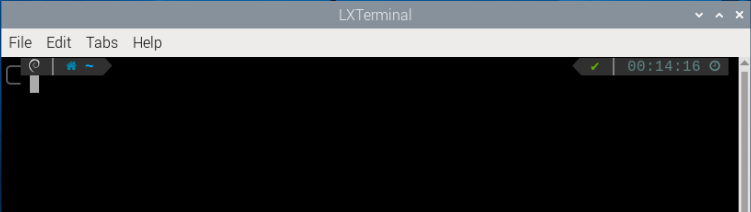

# AI视觉项目课程

## 1.智能避障

本节课可以通过超声波传感器检测障碍物，当检测到障碍物时，小车会自动避开。

### 1.1 实验原理

我们这里使用的是可发光的超声波测距模块，在测距芯片内部集成超声波发射电路、超声波接收电路、数字处理电路等。模块采用IIC通信接口，能通过IIC通信进行读取超声波传感器测量的距离。

它具备两个探头，分别用于发射和接收超声波。


测距原理：测距时模块会自动发送8个40khz 的方波，然后检测是否有信号返回；如果有信号返回，便输出一个高电平，高电平持续的时间就是超声波从发射到返回的时间。

具体公式为：**测试距离=(高电平时间\*声速(340M/S))/2**

当智能避障玩法启动时，会通过超声波传感器测量与前方物体的距离，进而控制小车进行移动。当大于设定距离，小车将向前移动；当小于设定距离，小车将停止前进，转向避开障碍物。

该程序的源代码位于： **/home/pi/GoGoPi/functions/avoidance.py**

<p id="anchor_1_2"></p>

### 1.2 实验步骤

:::{Note}
指令的输入需严格区分大小写和空格，另外可按键盘"**Tab**"键进行关键词补齐。
:::

1. 将GoGoPi开机，并参照课程资料的"**[远程工具的安装及连接](https://docs.hiwonder.com/projects/GoGoPi/en/latest/docs/6.remote.html)**"内容，通过VNC远程连接工具连接。


2. 单击系统桌面左上角的图标，或按下快捷键"**Ctrl+Alt+T**"打开LX终端。


3. 在打开的界面中，输入如下指令，按下回车键，切换到玩法程序所在目录。

```commandline
cd /home/pi/GoGoPi/functions/
```

4. 然后输入如下指令，按下回车键，运行玩法程序。

```commandline
python3 avoidance.py
```

5. 如需关闭此程序，可按下"**Ctrl+c**"，若关闭失败，可多次按下。

### 1.3 功能实现

玩法开启后，可在回传画面显示与被测物体的距离，当小车与被测物体距离小于等于30cm时，小车向左转；当距离大于30cm时，则继续向前行驶。

### 1.4 功能延伸

- #### 修改测距阈值

玩法默认的距离阈值为30cm，如需修改距离值，可参照以下步骤进行修改，本节以使小车与被测物体距离小于等于20cm左转为例进行修改。

1)  输入进入玩法程序所在目录的指令，按下回车键。

```commandline
cd /home/pi/GoGoPi/functions/
```

2)  输入如下指令，回车，打开程序文件。

```commandline
vim avoidance.py
```

3. 输入如下指令，按下回车，将行号调出来（用户根据需要自行设置即可）。

```commandline
:set number
```

4. 找到下图所示代码：


:::{Note}
在键盘输入代码位置序号后，按下"Shift+G"键，可直接跳转到对应位置。（图示代码位置序号仅供参考，请以实际为准。）
:::

5. 按一下键盘的"**i**"键，进入到编辑模式。


6. 将"**Threshold = 30.0**"中的"**30.0**"修改为"**20.0**"，如下图所示：


7. 修改完成后，按下键盘上的"**Esc**"键，然后依次输入"**:wq**"（注意wq前为冒号：），回车，即可保存并退出。

```commandline
:wq
```

8. 按照本文档的"[1.2 实验步骤](#anchor_1_2)"内容，再次启动该玩法，小车即可在与被测物体距离小于或等于20cm时左转。

- #### 修改速度

如需修改小车移动的速度，可按照以下步骤进行修改，本节将以速度修改为20为例进行说明。

1)  输入如下指令，回车，切换至源码程序路径下。

```commandline
cd /home/pi/GoGoPi/functions/
```

2. 然后输入如下指令，回车，打开程序文件。

```commandline
vim avoidance.py
```

3. 找到下图所示代码：


:::{Note}
在键盘输入代码位置序号后，按下"Shift+G"键，可直接跳转到对应位置。（图示代码位置序号仅供参考，请以实际为准。）
:::

4. 按一下键盘的"**i**"键，进入编辑模式。


5. 将"**speed = 40**"中的"**40**"修改为"**20**"，如下图所示：


6. 修改完成后，按下键盘上的"**Esc**"键，然后依次输入"**:wq**"（注意wq前为冒号:），回车，即可保存并退出。

```commandline
:wq
```

7. 按照本文档的"[1.2 实验步骤](#anchor_1_2)"内容，再次启动该玩法，小车即以20的速度行驶。

### 1.5 程序参数说明

该程序的源代码位于： **/home/pi/GoGoPi/functions/avoidance.py**

- #### 导入库文件

```python
import sys
import math
import cv2
import time
import signal
import threading
import numpy as np
import pandas as pd
from common import yaml_handle
from common.ros_robot_controller_sdk import Board
from common.sonar import Sonar
from common.mecanum importMecanumChassis
from calibration.camera import camera
```

- #### 定义全局变量

```python
if sys.version info.major == 2:
    print('please run this program with python3!')
    sys.exit(0)
    board = None
    car = Mecanumchassis()

    speed = 40
    old_speed = 0
    distance =500
    Threshold = 30.0
    distance_data = []

    TextSize = 12
    Textcolor =(0, 255, 255)
    turn = True
    forward = True
    HWSONAR = None
    stopMotor = True
    isRunning = False
```

- #### 主函数分析

**初始化与实例化工作**

```python
if __name__ == '__main__':
    from common.ros_robot_controller_sdk import Board
    board = Board()
    init()
    start()
    HWSONAR = Sonar()
    camera = camera()
    camera.camera_open(correction=True)
    signal.signal(signal.SIGINT,manual_stop)
    while __isRunning:
        img = camera.frame
        if img is not None:
            frame = img.copy()
            Frame = run(frame)
            frame_resize = cv2.resize(Frame, (320, 240))
            cv2.imshow('frame', frame_resize)
            key = cv2.waitKey(1)
            if key == 27:
                break
            else:
                time.sleep(0.01)
```

1.  调用init()函数对GoGoPi进行初始化工作。

```python
def init():
    print("Avoidance Init")
    initMove()
    reset()
```

2. 在init()函数中调用initMove()函数设置云台舵机初始的初始状态；

```python
def initMove():
    car.set_velocity(0, 0)
    servo_data = yaml_handle.get_yaml_data(yaml_handle.servo_file_path)
    servo1 = servo data['servo1']
    servo2 = servo data['servo2']
    board.pwm_servo_set_position(1,[[1,servo1],[2,servo2]])
```

3. 接着调用reset()函数对舵机，电机变量参数进行重置；

```python
def reset():
    global turn
    global speed
    global forward
    global distance
    global old speed
    global Threshold
    global stopMotor
    global __isRunning
    speed = 40
    old_speed = 0
    distance = 500
    Threshold = 30.0
    turn = True
    forward = True
    stopMotor = True
    __isRunning = False
```

4. 调用start()给变量赋初值。

```python
def start():
    global __isRunning
    global stopMotor
    global forward
    global turn
    __isRunning = True
    turn = True
    forward = True
    stopMotor = True
    print("Avoidance Start")
```

5. 对camera库进行实例化操作，并调用camera_open()函数开启相机畸变矫正。

```python
camera = camera()
camera.camera_open(correction = True)
```

**传感器检测处理**

1.  调用HWSONAAR库中的getDistance()函数获取超声波的检测值，再将它存放到data列表中。


```python
dist = HWSONAR.getDistance() / 10.0

distance_data.append(dist)
data = pd.DataFrame(distance_data)
data_ = data.copy()
```

2.  为了防止误识别，我们取识别五次的平均值，来判断是否识别到了障碍物。


```python
data_c = data[np.abs(data - u) <= std]
distance = data_c.mean()[0]

if len(distance_data) == 5:
    distance_data.remove(distance_data[0])
```

3.  再调用cv2库中的putText()函数，将超声波测距之打印在画面上。

```commandline
return cv2.putText(img, "Dist:ifcm"%distance, (30, 480-30), cv2.FONT_HERSHEY_SIMPLEX, 1.2, TextColor, 2)
```

**显示回传画面**

调用cv2库中的resize()函数对图形进行缩放，将其在回传画面中实时显示。

```python
while __isRunning:
    img = camera.frame
    if img is not None:
        frame = img.copy()
        Frame = run(frame)
        frame_resize =cv2.resize(Frame, (320, 240))
        cv2.imshow('frame', frame_resize)

        key = cv2.waitKey(1)
        if key == 27:
            break
```

- #### 子线程分析

运行子线程，调用move()函数，来控制GoGoPi小车的移动。

```python
th = threading.Thread(target=move)
th.daemon = True
th.start()
```

1)  在move()函数中，首先设定GoGoPi移动的速度。

```python
while True:
    if __isRunning:
        if speed != old_speed:
            old_speed = speed
            car.set_velocity(speed, speed)
```

电机控制以代码"**car.set_velocity(speed,speeed)**"为例，括号内的参数含义如下：

第一个参数"**speeed**"是电机1的速度，取值范围为-100~100；

第2个参数"**speeed**"是电机2的速度，取值范围为-100~100；

2)  接着根据超声波的检测值，来判断是否遇到了障碍物，若没有障碍物，小车直行，遇到障碍物，小车转弯。

```python
if distance <= Threshold:
    if turn:
        turn = False
        forward = True
        stopMotor = True
        car.set_velocity(0, speed)
        time.sleep(0.5)
    else:
        if forward:
            turn = True
            forward = False
            stopMotor = True
            car.set_velocity(speed, speed)
            else
            if stopMotor:
                stopMotor = False
                car.set_velocity(0, 0)
                turn = True
                forward = True
                time.sleep(0.03)
```

## 2. 单个颜色识别

本节通过摄像头来识别颜色,识别到红色小球时，蜂鸣器发出滴滴报警声，并在回传画面中圈出，打印"Color：red"。

### 2.1 实现原理

颜色识别的实现分为颜色识别和识别后的执行反馈两部分。

首先颜色识别部分，先进行高斯滤波（对图像中进行减噪），通过Lab颜色空间来对物品的颜色进行转换(关于Lab颜色空间的这个部分可以前往教程资料中 "**[OpenCV视觉基础课程](https://docs.hiwonder.com/projects/General_basic_courses/en/latest/docs/6_opencv.html)**"进行详细学习)。

接着通过颜色阈值对圆圈中的物体颜色进行识别，再对图像部分进行掩膜（掩膜是用选定的图像、图形或物体，对处理的图像进行全局或者局部遮挡）。

然后经过对物品图片开闭运算处理后，最后将轮廓最大的物体用圆圈圈出。

开运算：先对图像腐蚀后膨胀。作用：用来消除小的物体，平滑形状边界，并且不改变其面积。可以去除小颗粒噪声，断开物体之间的粘连。

闭运算：先对图像膨胀后腐蚀。作用：用来填充物体内的小空洞，连接邻近的物体，连接断开的轮廓线，平滑其边界的同时不改变面积。

在识别后对蜂鸣器进行设置，使小车根据不同颜色来做出对应的反馈。比如识别红色，蜂鸣器响一声。

关于详细对应的反馈效果，可参考本文档[2.3 功能实现](#anchor_2_3)。

### 2.2 玩法开启及关闭步骤

:::{Note}
指令输入需严格区分大小写及空格，关键字可以使用"Tab"键进行补齐。
:::

1)  将设备开机，并参照课程资料的"**[远程工具安装与连接](https://docs.hiwonder.com/projects/GoGoPi/en/latest/docs/6.remote.html)**"内容，通过VNC远程连接工具连接。


2)  点击系统桌面左上角的图标，或按下快捷键"**Ctrl+Alt+T**"打开LX终端。


3)  输入指令，按下回车，则可定位到存放玩法程序的目录。

```commandline
cd /home/pi/GoGoPi/function_demo
```

4)  输入指令，然后按下回车键，玩法启动。

```commandline
python3 individual_colors.py
```

5)  如需关闭此玩法，只需要在LX终端界面中按下"Ctrl+c"。若关闭失败，可多次按下。

<p id="anchor_2_3"></p>

### 2.3 实现效果

玩法开启后，通过摄像头来识别颜色,识别到红色小球时，蜂鸣器发出滴滴报警声，并在回传画面中圈出，打印 "Color: red"

:::{Note}
1)  识别过程中，请尽量保证在光线充足环境下进行识别，避免因光线问题导致识别不准确。
2)  识别过程中，摄像头视觉范围之内的背景中，不要出现与要识别颜色相近或相同的物体，避免误识别。
3)  若颜色识别不准确可参照本下文"**2.4 功能延伸--\>4.1调节颜色阈值**"，对颜色阈值进行设置。
:::

### 2.4 功能延伸

- #### 调节颜色阈值

在玩法体验的过程中，如识别物体颜色效果不佳，则需调节颜色阈值。**本节以调节红色为例，其他颜色设置方法皆可参考此方法，操作步骤如下**：

1)  双击系统桌面图标，在弹出的界面中点击"**Execute**"。


2)  进入界面后，点击"**Connect**"连接摄像头。


3)  连接成功后，在界面右下角的颜色选项栏中选择"**red**"。


4)  若在弹出的界面中未出现回传画面，说明摄像头未连接成功，需检查一下摄像头连接线是否连接好。

下图界面右侧是实时回传画面，左侧是需要被采集的颜色。将摄像头对准红色小球，然后拖动下方的六个滑杆，使得左侧画面中红色小球的区域全部变为白色，其它区域为黑色。接着点击"**Save**"按钮保存数据。


- #### 更换默认识别颜色

颜色识别程序内置了三种颜色：红色、绿色以及蓝色，其中默认识别到红色，小车便执行追踪。

**这里我们将识别颜色更换为绿色为例，具体修改步骤如下所示：**

1)  输入如下指令，回车，切换至源码程序路径下。

```commandline
cd /home/pi/GoGoPi/functions/
```

2)  然后再输入如下指令，回车，即可打开程序文件。

```commandline
vim color_tracking.py
```

3)  找到下图所示代码：


:::{Note}
在键盘输入代码位置序号后，按下"Shift+G"键，可直接跳转到对应位置。（图示代码位置序号仅供参考，请以实际为准。）
:::

4)  按下键盘上的"**i**"键，进入到编辑模式。


5)  将第3步红框在中的"**red**"换成"**green**"，如下图所示：


6)  接下来，保存我们修改的内容。按下"**Esc**"键，然后依次输入"**:wq**"（注意wq前为冒号：），回车即可保存并退出。


7)  再次输入如下指令，回车，即可开启颜色识别的玩法。

```commandline
python3 individual_colors.py
```

### 2.5 程序分析

该程序的源代码位于：**/home/pi/GoGoPi/ffunction_demo/individual_colors.py**

根据实现的效果，梳理程序的过程逻辑，如下图所示：

- #### 2.5.1 **导入功能库**

```commandline
#!/usr/bin/python3
# coding=utf8
import os
import sys
import cv2
import time
import signal
import math
import threading
9399343
import datetime
import numpy as np
from common import misc
from common import yaml_handle
from common.pid import PID
from common.mecanum import MecanumChassis
from calibration.camera import camera
```

- 导入opencv、时间、数学、线程相关的库。我们如果想要调用功能库里的函数，就可以使用"功能库名+函数名（参数，参数...）"如：

```python
time.sleep(0.01)
```

就是调用"**time**"库中的"**sleep**"函数，sleep()的作用是延时。

在python中有一些已经内置的库，我们直接导入调用就可以，比如"**time**"、"**cv2**"、"**math**"等。我们也可以自己写一个库，比如上面的"**yaml_handle**"文件读取库。

- #### 2.5.2 **实例化函数库**

我们有些函数库的名称太长，并且不容易记忆，为了方便调用函数，我们经常会对函数库进行实例化，如：

```python
import numpy as np
```

进行实例化后，在使用numpy库中的函数，就可以像这样"np**.函数名(参数,参数...)**"直接调用了，非常方便。

- #### 2.5.3 主函数分析

python程序中"**\_\_name\_\_ == '\_\_main\_\_:'**"就是程序的主函数。

**读取摄像头图像**

```commandline
cap = cv2.VideoCapture('http://127.0.0.1:8080?action=stream')
```

当玩法启动时，获取视频流并存储在"cap"中。

- #### 2.5.4 进入图像处理

读取到图像时，调用run()函数进行图像处理。

```commandline
if ert:
    frame = img.copy()
    Frame = run(frame)
```

1)  函数img.copy()的作用是将"**img**"的内容复制给"**frame**"。

2)  函数run()进行图像处理。

```python
def run(img):
    global buzzer_triggered # 使用全局变量
    detect_color ='None'
    draw_color = range_rgb["black"]
    
    img_copy = img.copy()
    img_h, img_w = img.shape[:2]
    
    frame_resize = cv2.resize(img_copy, size, interpolati0n=CV2.INTER_NEAREST)
    frame_gb = cv2.GaussianBlur(frame_resize,(3.3)，3)
    frame_lab = cv2.cvtcolor(frame_gb, cv2.COLOR_BGR2LAB)
```

- 对图片大小进行缩放，方便处理。

```python
frame_resize = cv2.resize(img_copy, size, imterpolation=cv2.INTER_NEAREST)
```

第一个参数"**img_copy**"是输入图像。

第二个参数"**size**"是输出图像的大小。大小可以自己设定。

第三个参数"**interpolation=cv2.INTER_NEAREST**"是插值方式。INTER_NEAREST：最邻近插值。INTER_LINEAR：双线性插值，如果最后一个参数你不指定，将默认使用这种方法。INTER_CUBIC：4x4像素邻域内的双立方插值。INTER_LANCZOS4：8x8像素邻域内的Lanczos插值。

- 高斯滤波

图像中总是会混入噪声，影响图像的质量，让特征不明显。根据不同的噪声种类选择对应的滤波方法，常见的有：高斯滤波、中值滤波、均值滤波等。

高斯滤波是一种线性平滑滤波，适用于消除高斯噪声，广泛应用于图像处理的减噪过程。

```python
frame_gb = cv2.GaussianBlur(frame_resize, (3, 3), 3)
```

第一个参数"**frame_resize**"是输入图像。

第二个参数"**(3, 3)**"是高斯内核大小。

第三个参数"**3**"是X方向上的高斯核标准偏差。

- 将图像转换到LAB空间，其中函数cv2.cvtColor()是颜色空间转换函数。

```python
frame_lab = cv2.cvTColor(frame_gb, cv2.COLOR_BGR2LAB)
```

第一个参数"**frame_gb**"是输入图像。

第二个参数"**cv2.COLOR_BGR2LAB**"是转换格式。"**cv2.COLOR_BGR2LAB**"是将BGR格式转换到LAB格式。如果要转换到RGB就可以使用"**cv2.COLOR_BGR2RGB**"。

- 将图像转换成二值图像，只有0和1，图像变得简单并且数据量减小，更容易处理。

采用cv2库中的inRange()函数对图像进行二值化处理。

```python
frame_mask = cv2.inRange(frame_lab,
                         (lab_data['red']['min'][o], lab_data['red']['min'][1], lab _data['red']['min'][2])
                         (lab_data['red']['max'][o], lab_data['red']['max'][1], lab_data['red']['max'][2]))
```

第一个参数"**frame_lab**"是输入图像；

第二个参数"**(lab_data\['red'\]\['min'\]\[0\],lab_data\['red'\]\['min'\]\[1\],lab_data\['red'\]\['min'\]\[2\])**"是颜色阈值下限；

第三个参数"**(lab_data\['red'\]\['max'\]\[0\],lab_data\['red'\]\['max'\]\[1\],lab_data\['red'\]\['max'\]\[2\])**"是颜色阈值上限；

- 使用OpenCV库中的erode和dilate函数来对图像（在这里是frame_mask）进行形态学操作，即腐蚀（Erosion）和膨胀（Dilation）。这两个操作通常用于图像处理中的噪声去除、前景背景分离、图像增强等任务。

```python
eroded = cv2.erode(frame_mask, cv2.getstructuringElement(cv2.MORPH_RECT, (3, 3)))
dilated = cv2.dilate(eroded, cv2.getstructuringElement(cv2.MORPH_RECT, (3, 3)))
```

第一个参数"**frame_mask**"是输入图像。

第二个参数"**cv2.MORPH_OPEN**"是形态操作的类型。cv2.MORPH_ERODE（腐蚀）,cv2.MORPH_DILATE（膨胀）,cv2.MORPH_OPEN（开运算)，cv2.MORPH_CLOSE（闭运算）

第三个参数"**((3, 3)**"是卷积核。

- 获取最大面积轮廓

完成上述的图像处理后，需要获取识别目标的轮廓，此处涉及cv2库中的findContours()函数。

```python
contours = cv2.findcontours(dilated, CV2.RETR_EXTERNAL, CV2.CHAIN_APPROX_NONE)[-2]
```

第一个参数"**closed**"是输入图像；

第二个参数"**cv2.RETR_EXTERNAL**"是轮廓的检索模式；

第三个参数"**cv2.CHAIN_APPROX_NONE)\[-2\]**"是轮廓的近似方法。

在获得的轮廓中寻找面积最大的轮廓，而为了避免干扰，需要设定一个最小值，仅当面积大于该值时，目标轮廓才有效,检测到颜色后，驱动蜂鸣器进行鸣响。

```python
if areaMaxContour is not None and area_max > 200:
    if not buzzer_triggered:
        buzzer_triggered = True # 更新状态为已触发
        board.set_buzzer(1900,0.1,0.2,1) # Trigger the buzzer
```

- #### 2.5.5 显示回传画面

```python
frame_resize =cv2.resize(Frame,(320，240))
cv2.imshow('frame',frame_resize)
key = cv2.waitkey(1)
if key == 27:
    break
```
函数cv2.resize()的作用是把处理好的图像缩放到合适的大小。

函数cv2.imshow()的作用是在窗口显示图像，"**'frame'**"是窗口名称、"**frame_resize**"是显示内容。后面一定要有cv2.waitKey()，否则无法显示。

函数cv2.waitKey()的作用是等待按键输入，参数"**1**"是延迟时间。

## 3. 颜色位置识别

本节课可以通过摄像头进行颜色识别红绿蓝三色小球，并在回传画面中圈出，显示其XY坐标位置。

### 3.1 实现原理

目标追踪的实现可分为颜色识别和位置标记两部分。

首先颜色识别部分，先进行高斯滤波（对图像中进行减噪），通过Lab颜色空间来对物品的颜色进行转换(关于Lab颜色空间的这个部分可以前往"**[OpenCV视觉基础课程](https://docs.hiwonder.com/projects/General_basic_courses/en/latest/docs/6_opencv.html)**"课程进行详细学习)。

接着通过颜色阈值对圆圈中的物体颜色进行识别，再对图像部分进行掩膜（掩膜是用选定的图像、图形或物体，对处理的图像进行全局或者局部遮挡）。

然后经过对物品图片开闭运算处理后，最后将轮廓最大的物体用圆圈圈出。

开运算：先对图像腐蚀后膨胀。作用：用来消除小的物体，平滑形状边界，并且不改变其面积。可以去除小颗粒噪声，断开物体之间的粘连。

闭运算：先对图像膨胀后腐蚀。作用：用来填充物体内的小空洞，连接邻近的物体，连接断开的轮廓线，平滑其边界的同时不改变面积。

位置标记需要使用特定的检测算法。其基本原理是在图像中寻找符合预定义特征或模式的区域，然后返回这些区域的位置和边界框。

### 3.2 玩法开启及关闭步骤

:::{Note}
指令的输入需严格区分大小写和空格，另外可按键盘"**Tab**"键进行关键词补齐。
:::

1.  将设备开机，并参照课程资料的"**[远程工具的安装与连接](https://docs.hiwonder.com/projects/GoGoPi/en/latest/docs/6.remote.html)**"内容，通过VNC远程连接工具连接。


2.  点击系统桌面左上角的图标，或按下快捷键"Ctrl+Alt+T"打开LX终端。


3.  在打开的界面中，输入进入玩法程序所在目录的指令，按下回车键。

```commandline
cd /home/pi/GoGoPi/function_demo
```

4. 然后输入启动玩法的指令，按下回车键。

```commandline
python3 Target_location_identification.py
```

5. 如需关闭此程序，可按下"**Ctrl+c**"，若关闭失败，可多次按下。

### 3.3 实现效果

**程序默认的追踪颜色为红绿蓝三色小球，识别完成后在回传画面中圈出，并显示其XY坐标位置**。

:::{Note}
1)  识别过程中，请尽量保证在光线充足环境下进行识别，避免因光线问题导致识别不准确。
2)  识别过程中，摄像头视觉范围之内的背景中，不要出现与要识别颜色相近或相同的物体，避免误识别。
3)  若颜色识别不准确可参照本文档"4.功能延伸--\>4.1颜色调节阈值"，对颜色阈值进行设置。
:::

### 3.4 功能延伸

- #### 3.4.1 调节颜色阈值

在玩法体验的过程中，如识别物体颜色效果不佳，则需调节颜色阈值。**本节以调节红色为例，其他颜色设置方法皆可参考此方法，操作步骤如下**：

1)  双击系统桌面图标，在弹出的界面中点击"**Execute**"。


2)  进入界面后，点击"**Connect**"连接摄像头。


3)  连接成功后，在界面右下角的颜色选项栏中选择"**red**"。


4)  若在弹出的界面中未出现回传画面，说明摄像头未连接成功，需检查一下摄像头连接线是否连接好。

下图界面右侧是实时回传画面，左侧是需要被采集的颜色。将摄像头对准红色小球，然后拖动下方的六个滑杆，使得左侧画面中红色小球的区域全部变为白色，其它区域为黑色。接着点击"**Save**"按钮保存数据。


- #### 3.4.2 增加新的识别颜色

除了内置三种识别的颜色，我们还可以设置其它可识别的颜色，**比如我们以紫色作为新增的识别颜色为例，具体的修改步骤如下**：

1)  双击系统桌面图标，然后弹出的提示框内直接选择"**Execute**"即可。


2)  在弹出的界面中选择"**Connect**"。


3)  点击"**Add**"，然后为新增颜色命名（这里以"**purple**"为例），再点击"**OK**"。


4)  然后点击颜色选框的下拉按钮，选择"**purple**"。


5)  将摄像头对准紫色物体，拖动L、A、B应的滑杆，直到左侧画面里要识别的颜色区域变为白色，其他区域变成黑色。


6)  最后，再点击"**Save**"，保存一下调节好的颜色阈值。


7)  修改完成后，我们可以检查一下修改的值是否成功被写入进去，输入如下指令，回车，进入到程序代码所在目录。

```commandline
cd GoGoPi
```

8. 再输入如下指令，回车，打开程序文件。

```commandline
vim lab_config.yaml
```

9. 打开颜色阈值程序文件后，即可查看紫色阈值参数。


10. 输入如下指令进入程序文件所在文件夹

```commandline
cd/home/pi/GoGoPi/function_demo
```

11. 随后输入如下指令打开程序文件并按下"**i**"键进入编辑模式，找到下图所示代码部分。

```commandline
vim Target_location_identification.py
```


12. 手动输入添加"**'purple'**"和"**'purple': (128, 0, 128)**"，(128, 0, 128)为紫色的RGB值，此处需要调换RGB的顺序为BGR，因此处紫色的数值还是（128，0，128），颜色的RGB值可以前往-\>RGB颜色查询器查询）。


13. 接着找到如下图所示代码。


14. 手动输入添加框中内容，设置扩展板上的灯亮紫色（此处填写的是紫色的RGB值，颜色的RGB值可以前往-\>RGB颜色查询器查询）。如下图所示：


15. 保存我们修改的内容。按下"**Esc**"键，然后依次输入"**:wq**"（注意wq前为冒号：），回车即可保存并退出。：



16. 参照本文档"2.实验步骤"再次启动该玩法，将紫色物品放置到摄像头前，可看到小车将追踪动作。

17. 如果需要添加其他颜色作为可识别颜色，可参考前面步骤进行操作。

### 3.5 程序说明

该程序的源代码位于：**/home/pi/GoGoPi/function_demo/Target_location_identification.py**

根据实现的效果，梳理程序的过程逻辑，如下图所示：



- #### 3.5.1 导入功能库

```python
#!/usr/bin/python3
# coding=utf8
import os
import sys
import cv2
import time
import signal
import math
import threading
import datetime
import numpy as np
from common import misc
from common import yaml handle
from common.pid import PID
from common.mecanum import MecanumChassis
from calibration.camera import camera
```

1)  导入opencv、时间、数学、线程、逆运动学相关的库。我们如果想要调用功能库里的函数，就可以使用"**功能库名+函数名（参数，参数...）**"如：

```python
time.sleep(0.01)
```

就是调用"**time**"库中的"**sleep**"函数。sleep()的作用是延时。

2. 在python中有一些已经内置的库，我们直接导入调用就可以，比如"**time**"、"**cv2**"、"**math**"等。我们也可以自己写一个库，比如上面的"**yaml_handle**"文件读取库等。

**实例化函数库**

我们有些函数库的名称太长，并且不容易记忆，为了方便调用函数，我们经常会对函数库进行实例化，如：

```python
import numpy as np
```

进行实例化后，在使用Board库中的函数，就可以像这样"**Board.函数名(参数,参数...)**"直接调用了，非常方便。

- #### 3.5.2 主函数分析

python程序中"**\_\_name\_\_ == '\_\_main\_\_:'**"就是程序的主函数。首先要打开摄像头，并读取视频流通过read方法可以读取到每一帧的图片，查找并标记小球颜色并显示结果。通过循环读取显示就可以实现视频的播放，在视频读取展示结束后使用release函数释放资源。

```python
if __name__ =='__main__'
from common.ros_robot_controller_sdk import Board
board = Board()
cap = cv2.Videocapture('http://127.0.0.1:8080?action=stream')
while True:
    ret,img = cap.read()
    if ret:
        frame = img.copy()
        Frame = run(frame)
        frame_resize = cv2.resize(Frame,(320，240))
        cv2.imshow('frame',frame_resize)
        key = cv2.waitkey(1)
        if key == 27:
            break
        else:
            time.sleep(0.01)
            cv2.destroyAllWindows()
```

**读取摄像头图像**

```python
cap = cv2.VideoCapture('http://127.0.0.1:8080?action=stream')
```

当玩法启动时，首先读取摄像头。

**进入图像处理**

1)  函数run()进行图像处理。

```python
def run(img):
    global draw_color
    global color_list
    global detect_color
    img_copy = img.copy()
    img_h, img_w = img.shape[:2]
    frame_resize = cv2.resize(img_copy, size, interpolati0n=CV2.INTER_NEAREST)
    frame_gb = cv2.GaussianBlur(frame_resize,(3,3)，3)
    frame_lab = cv2.cvtcolor(frame_gb, cV2.COLOR_BGR2LAB) # 将图像转换到LAB空间(convert image to the LAB space)
```

- 对图片大小进行缩放，方便处理。

```python
frame_resize = cv2.resize(img_copy, size, interpolation=cv2.INTER_NEAREST)
```

第一个参数"**img_copy**"是输入图像。

第二个参数"**size**"是输出图像的大小。大小可以自己设定。

第三个参数"**interpolation=cv2.INTER_NEAREST**"是插值方式。INTER_NEAREST：最邻近插值。INTER_LINEAR：双线性插值，如果最后一个参数你不指定，将默认使用这种方法。INTER_CUBIC：4x4像素邻域内的双立方插值。INTER_LANCZOS4：8x8像素邻域内的Lanczos插值。

- 高斯滤波

图像中总是会混入噪声，影响图像的质量，让特征不明显。根据不同的噪声种类选择对应的滤波方法，常见的有：高斯滤波、中值滤波、均值滤波等。

高斯滤波是一种线性平滑滤波，适用于消除高斯噪声，广泛应用于图像处理的减噪过程。

```python
frame_gb = cv2.GaussianBlur(frame_resize, (3, 3), 3)
```

第一个参数"**frame_resize**"是输入图像。

第二个参数"**(3, 3)**"是高斯内核大小。

第三个参数"**3**"是X方向上的高斯核标准偏差。

- 将图像转换到LAB空间，其中函数cv2.cvtColor()是颜色空间转换函数。

```python
frame_lab = cv2.cvtColor(frame_gb, cv2.COLOR_BGR2LAB)   #将图像转换到LAB空间（convert image to the LAB spacce）
```

第一个参数"**frame_gb**"是输入图像。

第二个参数"**cv2.COLOR_BGR2LAB**"是转换格式。"**cv2.COLOR_BGR2LAB**"是将BGR格式转换到LAB格式。如果要转换到RGB就可以使用"**cv2.COLOR_BGR2RGB**"。

- 将图像转换成二值图像，只有0和1，图像变得简单并且数据量减小，更容易处理。

采用cv2库中的inRange()函数对图像进行二值化处理。

```python
frame_mask = cv2.inRange(frame_lab
                         (lab_data[i]['min'][0]
                          lab_data[i]['min'][1],
                          lab_data[i]['min'][2])
                         (lab_data[i]['max'][0],
                          lab _data[i]['max'][1],
                          lab_data[i]['max'][2]))
```

第一个参数"**frame_lab**"是输入图像；

第二个参数"**(lab_data\[i\]\['min'\]\[0\],lab_data\[i\]\['min'\]\[1\],lab_data\[i\]\['min'\]\[2\])**"是颜色阈值下限；

第三个参数"**(lab_data\[i\]\['max'\]\[0\],lab_data\[i\]\['max'\]\[1\],lab_data\[i\]\['max'\]\[2\])**"是颜色阈值上限；

- 为了降低干扰，令图像更平滑，需要对图像进行腐蚀和膨胀操作，腐蚀和膨胀是一种形态学操作，腐蚀通常用于减小图像中前景对象的尺寸或消除小的对象；膨胀通常用于增大图像中前景对象的尺寸或填补对象内部的小洞。

```python
eroded = cv2.erode(frame_mask, cv2.getstructuringElement(cv2.MORPH_RECT, (3, 3)))    #腐蚀(corrosion)
dilated = cv2.dilate(eroded, Cv2.getStructuringElement(CV2.MORPH_RECT, (3, 3)))     #膨胀(dilation)
```

- 获取最大面积轮廓

  完成上述的图像处理后，需要获取识别目标的轮廓，此处涉及cv2库中的findContours()函数。

```python
contours = cv2.findcontours(dilated, CV2.RETR_EXTERNAL, CV2.CHAIN_APPROX_NONE)[-2] #找出轮廓(find out)
```

第一个参数"dilated"是输入图像；

第二个参数"**cv2.RETR_EXTERNAL**"是轮廓的检索模式；

第三个参数"**cv2.CHAIN_APPROX_NONE)\[-2\]**"是轮廓的近似方法。

在获得的轮廓中寻找面积最大的轮廓，而为了避免干扰，需要设定一个值，仅当面积大于该值时，目标轮廓才有效。

```python
#找出最大轮廓(find out the contour with the
areaMaxContour,area_max= getAreaMaxContour(contours)
Ma
if areaMaxContour is not None:
    if area_max> max_area:#找最大面积(find out the maximal area)
        max area = area max
        color area max =i
        areaMaxContour max
        := areaMaxContour
```

- 获取位置信息

采用cv2库中的cv2.putText() 函数在图像上绘制文本

```python
cv2.putText(img, "color: " + detect color, (10, img.shapel0] - 10), CV2.FONT HERSHEY_SIMPLEX, 0.65, draw color, 2)
cv2.putText(img,f"({centerx}, icenterY})", (centerx, centerY - 20), CV2.FONT_HERSHEY_SIMPLEX, 1.0, range_rgb[color_area_max], 2)
```

第一个参数"img"是输入图像；

第二个参数 "Color: " + detect_color"是要绘制的文本内容，通常以字符串形式传入；f'({centerX}, {centerY})' 是要绘制的文本，显示圆心 (centerX, centerY) 的坐标。

第三个参数"(10, img.shape\[0\] - 10)"与"(centerX, centerY - 20)"是文本在图像中的起始坐标点，即文本左下角的位置（x, y）；

第四个参数"cv2.FONT_HERSHEY_SIMPLEX"表示使用简单的字体；

第五个参数"0.65" 字体大小的缩放因子，指定文本字体的大小缩小到默认大小的0.65倍，参数"1.0"表示文本字体为默认颜色；

第六个参数"draw_color"是文本的颜色；range_rgb\[color_area_max\]是指识别到的最大颜色范围；

第六个参数"2"是文本字体的线条粗细。

- 显示回传画面

```python
if ret:
    frame = img.copy()
    Frame = run(frame)
    frame_resize = cv2.resize(Frame,(320, 240))
    cv2.imshow('frame', frame resize)
    key = cv2.waitKey(1)
    if key == 27:
        break
```

函数cv2.imshow()的作用是在窗口显示图像，"**'Frame'**"是窗口名称、"**frame**"是显示内容。后面一定要有cv2.waitKey()，否则无法显示。

函数cv2.waitKey()的作用是等待按键输入，参数"**1**"是延迟时间。

## 4. 颜色追踪

本节通过摄像头来识别颜色，当识别到颜色，云台将进行追踪。

### 4.1 实验原理

颜色识别的实现分为颜色识别和识别后的执行反馈两部分。

首先颜色识别部分，通过Lab颜色空间来对物品的颜色进行转换(关于Lab颜色空间的这个部分可以前往 "**[OpenCV基础课程](https://docs.hiwonder.com/projects/General_basic_courses/en/latest/docs/6_opencv.html)**"进行详细学习)。

接着通过颜色阈值对圆圈中的物体颜色进行识别，再对图像部分进行掩膜（掩膜是用选定的图像、图形或物体，对处理的图像进行全局或者局部遮挡）。

然后经过对物品图片开闭运算处理后，最后将轮廓最大的物体用圆圈圈出。

开运算：先对图像腐蚀后膨胀。作用：用来消除小的物体，平滑形状边界，并且不改变其面积。可以去除小颗粒噪声，断开物体之间的粘连。

闭运算：先对图像膨胀后腐蚀。作用：用来填充物体内的小空洞，连接邻近的物体，连接断开的轮廓线，平滑其边界的同时不改变面积。

在识别后对云台、RGB彩灯进行设置，使小车根据不同颜色来做出对应的反馈。比如识别红色，RGB彩灯亮红色GoGoPi会根据小球的远近距离进行移动。

<p id="anchor_4_2"></p>

### 4.2 实验步骤

:::{Note}
指令输入需严格区分大小写及空格，关键字可以使用"Tab"键进行补齐。
:::

1)  将设备开机，并参照课程资料的"**[远程工具的安装与连接](https://docs.hiwonder.com/projects/GoGoPi/en/latest/docs/6.remote.html)**"内容，通过VNC远程连接工具连接。可将配件包的红绿蓝小球取出，搭配使用。为了更好的体验效果，建议手持小球左右或上下移动时尽量保持缓慢，切勿快速大幅甩动。


2)  点击系统桌面左上角的图标，或按下快捷键"**Ctrl+Alt+T**"打开LX终端。



3)  输入如下指令，按下回车，则可定位到存放玩法程序的目录。

```commandline
cd /home/pi/GoGoPi/functions/
```

4)  输入如下指令，然后按下回车键，玩法启动。

```commandline
python3 color_tracking.py
```

5)  如需关闭此玩法，只需要在LX终端界面中按下"**Ctrl+c**"。若关闭失败，可多次按下。

### 4.3 功能实现

玩法开启后，在识别后，摄像头将进行追踪红色。

:::{Note}
- 识别过程中，请尽量保证在光线充足环境下进行识别，避免因光线问题导致识别不准确。
- 识别过程中，摄像头视觉范围之内的背景中，不要出现与要识别颜色相近或相同的物体，避免误识别。
- 若颜色识别不准确可参照本文档"4.功能延伸--\>4.1调节颜色阈值"，对颜色阈值进行设置。
:::

### 4.4 功能延伸

- #### 4.4.1 调节颜色阈值

在玩法体验的过程中，如识别物体颜色效果不佳，则需调节颜色阈值。**本节以调节红色为例，其他颜色设置方法皆可参考此方法，操作步骤如下**：

1)  双击系统桌面图标，在弹出的界面中点击"**Execute**"。


2)  进入界面后，点击"**Connect**"连接摄像头。


3)  连接成功后，在界面右下角的颜色选项栏中选择"**red**"。


4)  若在弹出的界面中未出现回传画面，说明摄像头未连接成功，需检查一下摄像头连接线是否连接好。

下图界面右侧是实时回传画面，左侧是需要被采集的颜色。将摄像头对准红色小球，然后拖动下方的六个滑杆，使得左侧画面中红色小球的区域全部变为白色，其它区域为黑色。接着点击"**Save**"按钮保存数据。


<p id="anchor_4_4_2"></p>

- #### 4.4.2 更换默认识别颜色

颜色识别程序内置了三种颜色：红色、绿色以及蓝色，其中默认识别到红色，小车便执行追踪。

**这里我们将识别颜色更换为绿色为例，具体修改步骤如下所示：**

1)  输入如下指令，回车，切换至源码程序路径下。

```commandline
cd /home/pi/GoGoPi/functions/
```

2)  然后再输入如下指令，回车，即可打开程序文件。

```commandline
vim color_tracking.py
```

3)  找到下图所示代码：


:::{Note}
在键盘输入代码位置序号后，按下"Shift+G"键，可直接跳转到对应位置。（图示代码位置序号仅供参考，请以实际为准。）**
:::

4)  按下键盘上的"**i**"键，进入到编辑模式。


5)  将"**setTargetColor((red,))** 中的"**red**"换成"**green**"，如下图所示：


6)  接下来，保存我们修改的内容。按下"**Esc**"键，然后依次输入"**:wq**"（注意wq前为冒号:），回车即可保存并退出。

```commandline
:wq
```

7)  再次输入如下指令，回车，即可开启颜色识别的玩法。

```commandline
python3 ColorDetect.py
```

- #### 4.4.3 增加新的识别颜色

除了内置三种识别的颜色，我们还可以设置其它可识别的颜色，**比如我们以紫色作为新增的识别颜色为例，具体的修改步骤如下**：

1)  双击系统桌面图标，然后弹出的提示框内直接选择"**Execute**"即可。


2)  在弹出的界面中选择"**Connect**"。


3)  点击"**Add**"，然后为新增颜色命名（这里以"**purple**"为例），再点击"**OK**"。


4)  然后点击颜色选框的下拉按钮，选择"**purple**"。


5)  将摄像头对准紫色物体，拖动L、A、B应的滑杆，直到左侧画面里要识别的颜色区域变为白色，其他区域变成黑色。


6)  最后，再点击"**Save**"，保存一下调节好的颜色阈值。


7)  修改完成后，我们可以检查一下修改的值是否成功被写入进去，输入指令"**cd GoGoPi**"，回车，进入到程序代码所在目录。

```commandline
cd GoGoPi
```

8)  再输入如下指令，回车，打开程序文件。

```commandline
vim lab_config.yaml
```

9)  打开颜色阈值程序文件后，即可查看紫色阈值参数。


10) 再按照"[更换默认识别颜色](#anchor_4_4_2)"1—2步骤，打开程序文件并按下"**i**"键进入编辑模式，找到如下图所示代码。


11) 手动输入添加"**'purple'**"和"**'purple': (128, 0, 128)**"，(128, 0, 128)为紫色的RGB值，此处需要调换RGB的顺序为BGR，因此处紫色的数值还是（128，0，128），颜色的RGB值可以前往-\>[RGB颜色查询器](http://tools.jb51.net/static/colorpicker/)查询）。


12) 接着找到如下图所示代码。


13) 手动输入添加框中内容，设置扩展板上的灯亮紫色（此处填写的是紫色的RGB值，颜色的RGB值可以前往-\>[RGB颜色查询器](http://tools.jb51.net/static/colorpicker/)查询）。如下图所示：


14) 保存我们修改的内容。按下"**Esc**"键，然后依次输入"**:wq**"（注意wq前为冒号:），回车即可保存并退出。

```commandline
:wq
```

15) 参照本文档"[4.2 实验步骤](#anchor_4_2)"再次启动该玩法，将紫色物品放置到摄像头前，可看到小车将追踪动作，参照"[更换默认识别颜色](#anchor_4_4_2)"将默认识别颜色改为紫色即可。

16) 如果需要添加其他颜色作为可识别颜色，可参考前面步骤进行操作。

### 4.5 程序参数说明

该程序的源代码位于：**/home/pi/GoGoPi/functions/color_tracking.py**

- ####  4.5.1 导入功能库

```python
#!/usr/bin/python3
# coding=utf8
import os
import sys
import cv2
import time
import signal
import math
import
threading
datetime
import
import numpy as np
from common
import misc
from
common import yaml handle
from
common.pid import PID
from
common.mecanum importMecanumchassis
common.ros robot controller_sdk import Board
from
from calibration.camera import camera
```

1)  导入opencv、时间、数学、线程相关的库。我们如果想要调用功能库里的函数，就可以使用"**功能库名+函数名（参数，参数...）**"如：

```python
time.sleep(0.01)
```

就是调用"**time**"库中的"**sleep**"函数，sleep()的作用是延时。

在python中有一些已经内置的库，我们直接导入调用就可以，比如"**time**"、"**cv2**"、"**math**"等。我们也可以自己写一个库，比如上面的"**yaml_handle**"文件读取库。

**实例化函数库**

我们有些函数库的名称太长，并且不容易记忆，为了方便调用函数，我们经常会对函数库进行实例化，如：

```python
from common.ros_robot_controller_sdk import Board
board = Board()
```

进行实例化后，在使用board库中的函数，就可以像这样"**board.函数名(参数,参数...)**"直接调用了，非常方便。

- #### 4.5.2 主函数分析

python程序中"**\_\_name\_\_ == '\_\_main\_\_:'**"就是程序的主函数。首先调用函数init()进行初始化配置。本程序中初始化包括：舵机回到初始位置、读取颜色阈值文件。一般还有端口、外设、定时中断等配置，这些都要在初始化内容中完成。

```python
if __name__ == 'main':
    from common.ros_robot_controller_sdk import Board
    board = Board()
    init()
    start()
    setTargetcolor(('purple',))
    camera = camera()
    camera.camera_open(correction=False)
    signal.signal(signal.SIGINT,manual stop)
```

- **读取摄像头图像**

```python
while isRunning:
    img = camera.frame
```

当玩法启动时，将图像存储在"**img**"中。

- **进入图像处理**

读取到图像时，调用run()函数进行图像处理。

```python
if img is not None:
    frame = img.copy()
    Frame = run(frame)
```

1)  函数img.copy()的作用是将"**img**"的内容复制给"**frame**"。

2)  函数run()进行图像处理。


- 对图片大小进行缩放，方便处理。

```python
frame_resize = cv2.resize(img, (320, 240), interpolation=cv2.INIER_NEAREST)
```

第一个参数"**img_copy**"是输入图像。

第二个参数"**size**"是输出图像的大小。大小可以自己设定。

第三个参数"**interpolation=cv2.INTER_NEAREST**"是插值方式。INTER_NEAREST：最邻近插值。INTER_LINEAR：双线性插值，如果最后一个参数你不指定，将默认使用这种方法。INTER_CUBIC：4x4像素邻域内的双立方插值。INTER_LANCZOS4：8x8像素邻域内的Lanczos插值。

- 开运算

图像中总是会混入噪声，影响图像的质量，让特征不明显。cv2.morphologyEx 能够进行多种形态学操作，如腐蚀(erode)、膨胀(dilate)、开运算(open)和闭运算(close)等。使得图像更少的噪点并且物体边界更加平滑。

```python
opened = cv2.morphologyEx(frame_mask, cv2.MORPH_OPEN, np.ones(6, 6), np.uint8)
```

第一个参数"**frame_mask** "是二值图像。

第二个参数"**cv2.MORPH_OPEN**"指定了要执行的操作类型是开运算。

第三个参数"**np.ones((6, 6), np.uint8)**" 创建了一个6x6的正方形结构元素，这个结构元素在开运算中用作核。

- 将图像转换到LAB空间，其中函数cv2.cvtColor()是颜色空间转换函数。

```python
frame_lab = cv2.cvtColor(frame_resize, cv2.COLOR_BGR2LAB)
```

第一个参数"**frame_resize**"是输入图像。

第二个参数"**cv2.COLOR_BGR2LAB**"是转换格式。"cv2.COLOR_BGR2LAB"是将BGR格式转换到LAB格式。如果要转换到RGB就可以使用"cv2.COLOR_BGR2RGB"。

- 将图像转换成二值图像，只有0和1，图像变得简单并且数据量减小，更容易处理。

采用cv2库中的inRange()函数对图像进行二值化处理。


```python
frame mask = cv2.inRange(frame lab,(lab_data[target color]['min'][0],
                                    lab_data[target color]['min'][1],
                                    lab_data[target color]['min'][2]),
                                   (lab_data[target color]['max'][0],
                                    lab_data[target color]['max'][1],
                                    lab_data[target_color]['max'][2]))
```

第一个参数"**frame_lab**"是输入图像；

第二个参数"**lab_data\[target_color\]\['min'\]\[0\],**

**lab_data\[target_color\]\['min'\]\[1\],**

**lab_data\[target_color\]\['min'\]\[2\])**"是颜色阈值下限；

第三个参数" **(lab_data\[target_color\]\['max'\]\[0\],**

**lab_data\[target_color\]\['max'\]\[1\],**

**lab_data\[target_color\]\['max'\]\[2\]))** "是颜色阈值上限；

- 为了降低干扰，令图像更平滑，需要对图像进行开运算和闭运算，开运算是先腐蚀再膨胀，闭运算是先膨胀再腐蚀。函数cv2.morphologyEx()是形态学函数。


第一个参数"**frame_mask**"是输入图像。

第二个参数"**cv2.MORPH_OPEN**"是形态操作的类型。cv2.MORPH_ERODE（腐蚀）,cv2.MORPH_DILATE（膨胀）,cv2.MORPH_OPEN（开运算)，cv2.MORPH_CLOSE（闭运算）

第三个参数"**np.ones((6, 6)**"是卷积核。

第四个参数"**np.uint8**"是应用次数。

**获取最大面积轮廓**

完成上述的图像处理后，需要获取识别目标的轮廓，此处涉及cv2库中的findContours()函数。

```python
contours = cv2.findContours(closed, cv2.RETR_EXTERMAL, cv2.CHAIN_APPROX_SIMPLE)[-2]
```

第一个参数"closed"是输入图像；

第二个参数"cv2.RETR_EXTERNAL"是轮廓的检索模式；

第三个参数"cv2.CHAIN_APPROX_NONE)\[-2\]"是轮廓的近似方法。

在获得的轮廓中寻找面积最大的轮廓，在识别到的轮廓中找到最大的那个，并且计算出能包围它的最小圆的大小和位置。如果该圆足够大（半径至少为 3 像素）再执行下面的操作。

```commandline
areaMaxContour = getAreaMaxContour(contours)

if areaMaxContour is not None:
    (centerX, centerY), radius = cv2.minEnclosingCircle(areaMaxContour)
    if radius >= 3:
```

- **显示回传画面**

```commandline
frame_resize = cv2.resize(Frame, (320, 240))
cv2.imshow('frame', frame_resize)
key = cv2.waitKey(1)
if key == 27:
    break
else:
    time.sleep(0.01)
```

函数cv2.resize()的作用是把处理好的图像缩放到合适的大小。

函数cv2.imshow()的作用是在窗口显示图像，"'frame'"是窗口名称、"frame_resize"是显示内容。后面一定要有cv2.waitKey()，否则无法显示。

函数cv2.waitKey()的作用是等待按键输入，参数"1"是延迟时间。

- #### 4.5.3 小车和舵机程序分析

主要是对图像处理结果进行判断，再执行不同的反馈，包括了RGB灯、云台，小车等模块的控制。

```commandline
if radius >= 3:
    err = abs(imgcenter_y + 20 - centerY)
    if err < 30:
        servo1_pid.SetPoint = centerY
    else:
        servo1_pid.SetPoint =img_center_y + 20

    servo1 pid.update(centerY)
    tmp = int(servo1 pulse + servo1 pid.output )
    tmp = 950 if tmp < 950 else tmp
    servo1 pulse =2000 if tmp > 2000 else tmp
    
    err = abs(img centerx - centerX)
    if err < 40:
        servo2 pid.SetPoint =2 * img center_x - centerX
    else:
        servo2 pid.setPoint = img center_x
        
    servo2 pid.update(2 * img center_x - centerX)
    tmp =int(servo2 pulse -servo2 pid.output)
    tmp = 500 if tmp < 500 else tmp
    servo2 pulse = 2500 if tmp > 2500 else tmp
    board.pwm_servo_set_position(0.02,[[1,servo1 _pulse],[2, servo2_pulse]]
    tmp = 0
```

- **点亮RGB灯**

根据识别的颜色，RGB灯颜色与识别的颜色一致。

```commandline
def set rgb(color):
    if color == "red":
        board.set rgb([[1, 255, 0, 0], [2, 255, 0, 0]])
    elif color == "green":
        board.set rgb([[1, 0, 255, 0], [2, 0, 255, 0]])
    elif color == "blue":
        board.set rgb([[1, 0, 0, 255], [2, 0, 0, 255]])
    else:
        board.set rgb([[1, 0, 0, 0], [2, 0, 0, 0]])
```

- **小车执行移动**

判断识别的颜色与设定颜色是否一致，执行追踪。


函数board.pwm_servo_set_position()是控制PWM舵机，以代码"**board.pwm_servo_set_position(0.3, \[\[1, servo1-100\]\])**"为例：

第一个参数"**0.3**"是表示舵机运动的持续时间，单位为秒。

第二个参数"**\[\[1, servo1-100\]\]**"表示要设置的舵机位置。它是一个列表，每个元素是一个二元组，包含舵机的编号和位置值。

## 5. 人脸位置识别

本节课程可通过摄像头进行人脸识别，并在回传画面中圈出，显示XY坐标。

### 5.1 实验原理

人工智能中最为一个广泛的应用当属图像识别，而图像识别中的人脸识别是最火热的应

用，常常应用于门锁和手机人脸解锁等场景。

人脸位置识别，使用训练好的人脸模型，通过缩放画面检测人脸，接着将识别到的人脸坐标转换为未缩放前的坐标，进而判断是否为最大的人脸，并将识别到的人脸框出，同时蜂鸣器发出滴滴响声。

该程序的源代码位于：**/home/pi/GoGoPi/function_demo/face_demo.py**

### 5.2 实验步骤

:::{Note}
指令的输入需严格区分大小写和空格，另外可按键盘"**Tab**"键进行关键词补齐。
:::

1. 将设备开机，并参照课程资料的"**[远程工具的安装与连接](https://docs.hiwonder.com/projects/GoGoPi/en/latest/docs/6.remote.html)**"内容，通过VNC远程连接工具连接。


2. 单击系统桌面左上角的图标，或按下快捷键"**Ctrl+Alt+T**"打开LX终端。


3. 在打开的界面中，输入进入玩法程序所在目录的指令，按下回车键。

```commandline
cd /home/pi/GoGoPi/function_demo
```

4. 然后输入启动玩法的指令，按下回车键。

```commandline
python3 face_tracking.py
```

5. 如需关闭此程序，可按下"**Ctrl+c**"，若关闭失败，可多次按下。

### 5.3 功能实现

:::{Note}
在进行人脸追踪的玩法时，请确保摄像头的视觉范围内只出现一张人脸，若出现多个人脸的话，会影响实验效果。**
:::

玩法开启后,当人脸被识别到后，在回传画面中圈出，并显示XY坐标,同时驱动蜂鸣器鸣响。

### 5.4 程序参数说明

该程序的源代码位于：**/home/pi/GoGoPi/function_demo/face_demo.py**

- #### 5.4.1 导入库文件

```python
#!/usr/bin/python3
# coding=utf8
import os
import sys
import cv2
import time
import signal
import math
import threading
import datetime
import numpy as np
from common import misc
from common import yaml_handle
from common.pid import PID
import numpy as np
import mediapipe as mp
from common.ros_robot_controller_sdk import Board
```

- #### 5.4.2 人脸检测

导入MediaPipe的面部检测模块来创建一个面部检测实例，设置最小检测置信度为0.5。

```python
# 人脸检测(face detection)
# 用于标记是否已触发蜂呜器
di_once = True
board = Board()
# 导入人脸识别模块(import human face detection module)
face = mp.solutions.face_detection
#自定义人脸识别方法，最小的人脸检测置信度0.5(custom human face recognition method, the minimum human face detection confidence is 0.5)
face_detection = face.FaceDetection(min_detection_confidence=0.5)
di once = True
detect_people = False
```

- #### 5.4.3 图像处理

将图像存储在img中，若图像不为空，调用run()函数进行图像处理。

```python
cap = cv2.Videocapture('http://127.0.0.1:8080?action=stream')
while True:
    ret,img = cap.read()
    if ret:
        frame = img.copy()
        Frame = run(frame)
```

- 在run()函数中，采用cv2库中的cv2.cvtColor()函数将BGR图像转为RGB图像。

```python
image_rgb = cv2.cvtColor(img_copy, cv2.COLOR_BGR2RGB)
```

第一个参数"**img_copy**"是输入图像；第二个参数"**cv2.COLOR_BGR2RGB**"是将BGR图像转化成RGB图像。

- 采用faceDetection库中的process()函数，将每一帧图像传给人脸识别模块。

```python
results = face_detection.process(image_rgb)
```

- 对获取到的人脸图像信息进行坐标转化。

  由于图像在预处理过程中，会经过缩放处理，得到的人脸坐标与实际画面是不匹配的。因此，在完成图像预处理后，需要对坐标进行转换。

```python
if results.detections:
    for detection in results.detections:
        bboxC = detection.location_data.relative_bounding_box
        bbox = (int(bboxC.xmin * img_w), int(bboxC.ymin * img_h),
               int(bboxC.width * img_w), int(bboxC.height * img_h))
```

- 通过调用cv2库中的rectangle()函数，用矩形方框标识出回传画面内的人脸。

```python
cv2.rectangle(img, bbox, (0, 255, 0), 2)
```

函数括号内的参数含义如下：

第一个参数"**img**"是输入图像；

第二个参数"**bbox**"是矩形的像素坐标；；

第三个参数"**(0, 255, 0)**"是矩形边线颜色，其顺序为B、G、R，此处为绿色；

第四个参数"**2**"是矩形边线宽度。值为"-1"时，代表用参数四指定颜色填充矩形。

- 显示回传画面

  调用cv2库中的resize()函数对图形进行缩放，将其在回传画面中实时显示。

```python
cv2.imshow('frame',frame_resize)
key = cv2.waitkey(1)
if key == 27:
    break
else:
    time.sleep(0.01)
```

- #### 5.4.4 子线程分析

运行子线程调用buzzer()函数，来控制蜂鸣器鸣响。

```python
运行子线程(run sub-thread)
庄
th = threading.Thread(target=buzzer)
th.daemon = True
th.start()
```

## 6. 人脸跟踪

本节课程可通过摄像头进行人脸识别，实现小车和云台舵机跟随人脸的移动而移动。

### 6.1 实验原理

人工智能中最为一个广泛的应用当属图像识别，而图像识别中的人脸识别是最火热的应

用，常常应用于门锁和手机人脸解锁等场景。

人脸追踪玩法的实现分为人脸识别，和追踪两个部分。

首先是人脸识别，我们先设定云台向上看，来获取人脸，然后使用训练好的人脸模型，通过缩放画面检测人脸，接着将识别到的人脸坐标转换为未缩放前的坐标，进而判断是否为最大的人脸，并将识别到的人脸框出。

最后根据PID算法通过画面中的中心坐标与实际人脸的位置做比对，从而控制电机与舵机进行转动，来执行识别后的反馈。

PID算法是应用最为广泛的一种自动控制器。在过程控制中，按误差的比例（P）、积分（I）和微分（D）进行控制。它具有原理简单，易于实现，适用面广，控制参数相互独立，参数的选定比较简单等优点。

该程序的源代码位于：**/home/pi/GoGoPi/functions/face_tracking.py**

### 6.2 实验步骤

:::{Note}
指令的输入需严格区分大小写和空格，另外可按键盘"**Tab**"键进行关键词补齐。
:::

1. 将设备开机，并参照课程资料的"**[远程工具的安装与连接](https://docs.hiwonder.com/projects/GoGoPi/en/latest/docs/6.remote.html)**"内容，通过VNC远程连接工具连接。


2. 单击系统桌面左上角的图标，或按下快捷键"**Ctrl+Alt+T**"打开LX终端。


3. 在打开的界面中，输入进入玩法程序所在目录的指令，按下回车键。

```commandline
cd /home/pi/GoGoPi/functions
```

4. 然后输入启动玩法的指令"**python3 face_tracking.py**"。按下回车键。

```commandline
python3 face_tracking.py
```

5. 如需关闭此程序，可按下"**Ctrl+c**"，若关闭失败，可多次按下。

### 6.3 功能实现

**注意：在进行人脸追踪的玩法时，请确保摄像头的视觉范围内只出现一张人脸，若出现多个人脸的话，会影响实验效果。**

玩法开启后云台舵机先向上看，寻找人脸，当脸部被识别到后，会将人脸目标框出，此时云台舵机和小车会随着人脸的移动而移动。


### 6.4 程序参数说明

该程序的源代码位于：**/home/pi/GoGoPi/functions/face_tracking.py**

- #### 6.4.1 导入库文件

```python
#!/usr/bin/python3
# coding=utf8
import os
import sys
import cv2
import time
import signal
import math
import threading
import datetime
import numpy as np
import mediapipe as mp
from common import misc
from common import yaml handle
from common.pid import PID
from common.mecanum import Mecanumchassis
from common.ros robot controller_sdk import Board
from calibration.camera import camera
```

- #### 6.4.2 定义全局变量

```python
board = None
if sys.version info.major == 2:
    print('please run this program with python3!')
    sys.exit(0)
    car = MecanumChassis()
    Face = mp.solutions.face_detection
    faceDetection = Face.FaceDetection(min_detection_confidence=0.5)
    servo1 = 1500
    serVo2 = 1500
    servo_x = servo2

    serv_en =False
    wheel_en = False
    size = (640, 480)
    __isRunning = False
    enablewheel = False
    center_x, center_y, area = -1, -1, 0
    car_x_pid = PID(P=0.27，I=0.06，D=0.015)
    car_y_pid = PID(P=0.15，I=0.03，D=0.008)
    servo_x_pid = PID(P=0.1,I=0.03， D=0.006)
    servoy_y_pid = PID(P=0.1, I=0.03, D=0.006)

    servo data = None
    def load_config():
        global servo data
        servo_data = yaml_handle.get_yaml_data(yaml_handle.servo_file_path)
```

- #### 6.4.3 主函数分析

**初始化与实例化工作**

```python
if __name__ == '__main__':
    from common.ros_robot_controller_sdk import Board
    board = Board()
    init()
    start()
    #setVehicleFollowing(True)
    camera = camera()
    camera.camera open(correction=True)
    signal.signal(signal.SIGINT, manual_stop)
    while __isRunning:
        img = camera.frame
        if img is not None:
            frame = img.copy()
            Frame = run(frame)
            frame_resize = cv2.resize(Frame, (320, 240))
            cv2.imshow('frame',frame_resize)
            key = cv2.waitKey(1)
            if key == 27:
                break
            else:
                time.sleep(0.01)
                camera.camera_close()
                cv2.destroyAllwindows()
```

1)  调用init()函数对GoGoPi进行初始化工作。

```python
def init():
    print("FaceTracking Init")
    load_config()
    reset()
    initMove()
```

2. 在init()函数中调用load_config()函数对云台舵机进行初始化工作；

```python
def load_config():
    global servo_data
    servp_data = yaml_handle.get_yaml_data(yaml_handle.servo_file_path)
```

3. 接着调用reset()函数对舵机，电机变量参数进行重置；

```python
def reset():
    global servo1, serVo2, car_en,wheel_en
    global servo_x, servoy, color_radius
    global center_x, center_y, area, enablewheel

    enableWheRl = False
    servo1 = rvo_data['servo1'] + 350
    servo2 = servo_data['servo2']
    servo_x = servo2
    servo_y = servo1
    car_x_pid.clear()
    car_y_pid.clear()
    servo_x_pid.clear()
    servo_y_pid.clear()
    color_radius =0
    center_x, center_y, area = -1, -1, 0
```

4. 最后调用initMove()函数设置云台舵机初始位置。

```python
def initMove():
board.pwm_servo_set_position(1,[[1,servo1],[2,servo2]])
range_rgb = {
    'red':(0, 0, 255)
    'blue':(255, 0, 0)
    'green':(0, 255, 0)
    'black':(0, 0, 0)
    'white':(255, 255, 255)
}
```

5. 调用start()函数开启人脸追踪的玩法。

```python
def start():
    global __isRunning
    reset()
    __isRunning = True
    print("FaceTracking Start")
```

6. 对camera库进行实例化操作，并调用camera_open()函数开启相机畸变矫正。

```python
camera = camera()
camera.camera_open(correction=True)
```

**图像处理**

将图像存储在img中，若图像不为空，调用run()函数进行图像处理。

```python
while __isRunnig:
    img = camera.frame
    if img is not None:
        frame = img.copy()
        Frame = run(frame)
```

- 在run()函数中，采用cv2库中的cv2.cvtColor()函数将BGR图像转为RGB图像。

```python
imgRGB = cv2.cvtColor(img_copy, cv2.COLOR_BGR2RGB)
```

第一个参数"**img_copy**"是输入图像；第二个参数"**cv2.COLOR_BGR2RGB**"是将BGR图像转化成RGB图像。

- 采用faceDetection库中的process()函数，将每一帧图像传给人脸识别模块。

```python
results = faceDetection.process(imgRGB)
```

- 对获取到的人脸图像信息进行坐标转化。

  由于图像在预处理过程中，会经过缩放处理，得到的人脸坐标与实际画面是不匹配的。因此，在完成图像预处理后，需要对坐标进行转换。

```python
if results.detections:
    for index, detection in enumerate(results.detections):
        bboxC = detection.location_data.relative_bounding_box
        bbox = (int(bboxC.xmin * img_w), int(bboxC.ymin * img h), int(bboxc.width * img_w), int(bboxc.height *img_h))
```

- 通过调用cv2库中的rectangle()函数，用矩形方框标识出回传画面内的人脸。

```python
cv2.rectangle(img, bbox, (0, 255, 0), 2)
```

函数括号内的参数含义如下：

第一个参数"**img**"是输入图像；

第二个参数"**bbox**"是矩形的像素坐标；；

第三个参数"**(0, 255, 0)**"是矩形边线颜色，其顺序为B、G、R，此处为绿色；

第四个参数"**2**"是矩形边线宽度。值为"-1"时，代表用参数四指定颜色填充矩形。

- 获取识别框的X、Y轴坐标信息

```python
center_x = int(x + (w/2))
center_y = int(y + (h/2))
```

**显示回传画面**

调用cv2库中的resize()函数对图形进行缩放，将其在回传画面中实时显示。

```python
cv2.imshow('frame', frame_resize)
key = cv2.waitKey(1)
if key == 27:
    break
else:
    time.sleep(0.01)
```

- #### 6.4.4 子线程分析

运行子线程调用move()函数，来控制云台舵机和麦轮车的移动。

```python
th = threading.Thread(target=move)
th.daemon = True
th.start()
```

1)  在move()函数中，使用PID算法来调整云台舵机的转动。

```python
if abs(center_x != -1 and center_y != -1:
       if abs(center_x - img_w/2.0) < 15:

       img w/2.0)< 15
center x=img w/2.0
servo_x_pid.SetPoint = img w/2.0
servo_x_pid.update(center x)
servo_x += int(servo_x_pid.output)
servo_x = 1000 if servo_x < 1000 else servo_x
servo_X = 2500 if servo_x > 2500 else servo_x

if abs(center_y - img_h/2.0) < 10:
    center_y = img_h/2.0
    servo_y_pid.SetPoint = img_h/2.0
    servo_y_pid.update(center_y)
    servo_y += int(servo_y_pid.output)
    servo_y = 500 if servo_y < 500 else servo_y
    servo_y = 2500 if servo_y > 2500 else servo_y
    board.pwm_servo_set_position(0.02, [[1,servo_y]， [2, servo_x]])
    time.sleep(0.01)
```

函数board.pwm_servo_set_position()是控制PWM舵机，以代码"**board.pwm_servo_set_position(0.02, \[\[1, servo_y\], \[2, servo_x\]\])**"为例：

第一个参数"**0.02**"是表示舵机运动的持续时间，单位为秒。

第二个参数"**\[\[1, servo_y\], \[2, servo_x\]\]**"表示要设置的舵机位置。它是一个列表，每个元素是一个二元组，包含舵机的编号和位置值。

2)  同理，小车的移动也是根据PID算法来调整电机转动的。

```python
if area < target_area:
    car_y_pid.SetPoint = target_area
else:
    car_y_pid.SetPoint = area
    car_y_pid.update(area)
    dy = car_y_pid.output
    dy = min(max(dy, -100), 100)

    car_x_pid.SetPoint = servo2
    car_x_pid.update(servo_x)
    dx = carx_pid.output
    dx= min(max(dx, -100), 100)

    motor1 = dy + dx
    motor1 direct =-1 if motor1 < o else 1

    motor2 =dy + dx
    motor2 direct = -1 if motor2 < o else 1

    motor1=misc.map(abs(motor1, 0, 100, 30, 60)
    motor2 =misc.map(abs(motor2, 0, 100, 30, 60)

    car.set_velocity(int(motor_direct * motor1),int(motor2_direct * motor2)
    car_en = True
    time.sleep(0.02)
```

电机控制以代码"**car.set_velocity(int(motor1_direct \* motor1),int(motor2_direct \* motor2))**"为例，括号内的参数含义如下：

第一个参数"**(int(motor1_direct \* motor1)**"是电机1的速度；

第二个参数："**(int(motor2_direct \* motor2)**"是电机2的速度。

## 7. 手势识别

本节课可以通过摄像头对手势进行识别，进而控制小车运动。

### 7.1 实验原理

手势识别玩法的实现分为手势识别处理和识别后的执行反馈两部分。

首先是手势识别部分，通过使用mediapipa模型以及颜色转换去找到手部模型并识别处理。

MediaPipe是一款开源的多媒体机器学习模型应用框架。可在移动设备、工作站和服务器上跨平台运行，并支持移动GPU加速。还支持TensorFlow和TF Lite的推理引擎（Inference Engine），任何TensorFlow和TF Lite的模型都可以在MediaPipe上使用。同时，在移动端和嵌入式平台，MediaPipe也支持设备本身的GPU加速。

然后在识别后对舵机进行设置，使小车根据不同手势来做出对应的反馈。比如识别手势数字"**1**"，将云台设置为"点头"。

关于详细对应的反馈效果，可参考本文档[7.3 功能实现](#anchor_7_3)。

该程序的源代码位于： **/home/pi/GoGoPi/functions/finger_detect.py**

### 7.2 实验步骤

:::{Note}
指令输入需严格区分大小写及空格，关键字可以使用"Tab"键进行补齐。
:::

1)  将设备开机，并参照课程资料的"**[远程工具的安装与连接](https://docs.hiwonder.com/projects/GoGoPi/en/latest/docs/6.remote.html)**"内容，通过VNC远程连接工具连接。


2)  点击系统桌面左上角的图标，或按下快捷键"**Ctrl+Alt+T**"打开LX终端。


3)  输入如下指令，按下回车，则可定位到存放玩法程序的目录。

```
/home/pi/GoGoPi/functions/
```

4)  输入如下指令，然后按下回车键，玩法启动。

```commandline
python3 finger_detect.py
```

5)  如需关闭此玩法，只需要在LX终端界面中按下"**Ctrl+c**"。若关闭失败，可多次按下。

<p id="anchor_7_3"></p>

### 7.3 功能实现

玩法开启后，在识别后，小车根据不同手势执行对应的动作，效果如下表所示：

| 手势动作 | 手势示意图 | 执行动作 |
|:--:|:--:|:--:|
| 手势"1" |  | "云台点头" |
| 手势"2" |  | "云台摇头" |
| 手势"3" |  | "蜂鸣器响一声" |
| 手势"4" |  | "后退" |
| 手势"5" |  | "前进一下后退一下" |

:::{Note}
这里执行的动作都是都是以GoGoPi小车为第一视角的。
:::

### 7.4 功能延伸

- #### 7.4.1 修改速度

如需修改小车移动方向，可按照以下步骤进行修改，本节将以识别到"手势4"小车右转为例进行说明。

1)  输入如下指令，回车，切换至源码程序路径下。

```commandline
cd /home/pi/GoGoPi/functions/
```

2)  然后再输入如下指令，回车，即可打开程序文件。

```commandline
vim finger_detect.py
```

3)  找到下图所示代码：

```commandline
elif gesture_num == 4:
    car.set_velocity(-50, -50)
    time.sleep(0.1)
    car.set_velocity(0, 0)
```

:::{Note}
在键盘输入代码位置序号后，按下"Shift+G"键，可直接跳转到对应位置。（图示代码位置序号仅供参考，请以实际为准。）
:::

4)  按下键盘上的"**i**"键，进入到编辑模式。


5)  将"**car.set_velocity(-50,-50)**"中的第一个"-50"换成"5**0**"，如下图所示：


6)  接下来，保存我们修改的内容。按下"**Esc**"键，然后依次输入"**:wq**"（注意wq前为冒号：），回车即可保存并退出。


7)  再次输入如下指令，回车，即可开启手势识别的玩法。

```commandline
python3 finger_detect.py
```

- #### 7.4.2 修改小车的运行时间

1)  输入如下指令，回车，切换至源码程序路径下。

```commandline
cd /home/pi/GoGoPi/functions/
```

2. 输入如下指令，回车，即可打开程序文件。

```commandline
vim finger_detect.py
```

3. 找到下图所示代码。

```python
elif gesture_num == 4:
    car.set_velocity(-50，-50)
    time.sleep(0.1)
    car.set velocity(0,0)
elif gesture num == 5:
    car.set_velocity(50,50)
    time.sleep(0.15)
    car.setvelocity(-45,-45)
    time.sleep(0.15)
    car.set_velocity(0,0)
    
    results lock = False
```

4. 按下键盘上的"**i**"键，进入到编辑模式。


5. 将"**time.sleep(0.15)**"中的"0.15"改成"1"，如下图所示


6. 接下来，保存我们修改的内容。按下"**Esc**"键，然后依次输入"**:wq**"（注意wq前为冒号：），回车即可保存并退出。


7. 再次输入如下指令，回车，即可开启手势识别的玩法。

```commandline
python3 finger_detect.py
```

### 7.5 程序参数说明

- #### 7.5.1 导入功能库

```python
#!/usr/bin/python3
# coding=utf8
import cv2
import os
import sys
import time
import signal
import math
import threading
import datetime
import mediapipe as mp
import numpy as np
from common import misc
from common import yaml_handle
from common.pid import PID
from common.mecanum import Mecanumchassis
from common.ros_robot_controller_sdk import Board
from calibration.camera import camera
```

1)  导入opencv、时间、数学、线程、逆运动学相关的库。我们如果想要调用功能库里的函数，就可以使用"**功能库名+函数名（参数，参数...）**"如：

```python
time.sleep(0.01)
```

就是调用"**time**"库中的"**sleep**"函数，sleep()的作用是延时。

在python中有一些已经内置的库，我们直接导入调用就可以，比如"**time**"、"**cv2**"、"**math**"等。我们也可以自己写一个库，比如上面的"**yaml_handle**"文件读取库。

2)  实例化函数库。

我们有些函数库的名称太长，并且不容易记忆，为了方便调用函数，我们经常会对函数库进行实例化，如：

```python
from common.ros_robot_controller_sdk import Board
board = Board()
```

进行实例化后，在使用board库中的函数，就可以像这样"**board.函数名(参数,参数...)**"直接调用了，非常方便。

- #### 7.5.2 主函数分析

python程序中"**\_\_name\_\_ == '\_\_main\_\_:'**"就是程序的主函数。首先调用函数init()进行初始化配置。本程序中初始化包括：摄像头回到初始位置、读取颜色阈值文件。一般还有端口、外设、定时中断等配置，这些都要在初始化内容中完成。

```python
if __name__ == '__main__':
    from common.ros_robot_controller_sdk import Board
	board = Board()
	init()
```

1. 读取摄像头图像

```python
while __isRunning:
    img = camera.frame
```

当玩法启动时，将图像存储在"**img**"中。

2. 进入图像处理

读取到图像时，调用run()函数进行图像处理。

```python
if img is not None:
    frame = img.copy()
    Frame = run(frame)
```

函数img.copy()的作用是将"**img**"的内容复制给"**frame**"。

函数run()进行图像处理。

```python
def run(img):
    global __isRunning
    global gesture_num
    global results_lock
    global results_list
    if not __isRunning:
        return img
    if results_lock:
        return img

    gesture num = 0
    img_copy = img.copy()
    img_h,img_w = img.shape[:2]
    imgRGB = cv2.cvtColor(img_copy, cv2.COLOR_BGR2RGB)
    results = hands.process(imgRGB)
    if results.multi_hand_landmarks:
        for hand_landmarks in results.multi_hand_landmarks:
            mp_drawing.draw_landmarks(img, hand_landmarks, mp_hands.HAND_CONNECTIONS)
            hand_local = [(landmark.x * img_w, landmark.y * img_h) for landnmark in hand_landmarks.landmark]
            if hand_local:
                angle_list = hand_angle(hand_local)
                gesture_results =gesture(angle_list)
                cv2.putText(img,str(gesture_results), (20, 50), 2, (255, 100, 0), 3)
                if gesture_results:
                    results_list.append(gesture_results)
                    if len(results_list) == 5:
                        gesture_num =np.mean(np.array(results_list))
                        results_lock = True
                        results_list = []
```

- 将图像从BGR转换为RGB，其中函数cv2.cvtColor()是颜色空间转换函数。

```python
imgRGB = cv2.cvtColor(img_copy, cv2.COLOR_BGR2RGB)
```

第一个参数"**img_copy**"是输入图像。

第二个参数"**cv2.COLOR_BGR2RGB**"是转换格式。"cv2.COLOR_BGR2RGB"是将BGR格式转换到RGB格式。如果要转换到LAB就可以使用"cv2.COLOR_BGR2LAB"。

- 调用cv2.putText()函数，该函数是可以对应的在图像上绘制字符串或者文本等信息。

```python
cv2.putText(img, srt(gesture_results), (20, 50), 0, 2, (255, 100, 0), 3)
```

第一个参数"**img**"指的是输入的图像。

第二个参数"**str(gesture results)**"指的要绘制的内容信息。

第三个参数"**(20,50)**"是图像中字符串的坐标位置。

第四个参数"**0**"指的是字体的类型。

第五个参数"**2**"指的是字体的大小。

第六个参数"**(255,100,0)**"是绘制的字符串的颜色。

第七个参数"**3**"是线的粗细像素的大小。

3. 显示回传画面

```python
frame_resize = cv2.resize(Frame, (320, 240))
cv2.imshow('frame', frame_resize)
key = cv2.waitKey(1)
if key == 27:
    break
else:
    time.sleep(0.01)
```

函数cv2.resize()的作用是把处理好的图像缩放的合适大小。

函数cv2.imshow()的作用是在窗口显示图像，"**'frame'**"是窗口名称、"**frame_resize**"是显示内容。后面一定要有cv2.waitKey()，否则无法显示。

函数cv2.waitKey()的作用是等待按键输入，参数"**1**"是延迟时间。

- #### 7.5.3 子线程分析

1. 识别手势

手势识别是通过mediapipe框架来构建手部的一个关键点，再绘制出关键点的坐标，进而获取系列信息并给下一步的执行提供反馈。

首先是判断是否有手部的关键点，如果有的话，就计算出对应的关键点坐标。

```python
if results.multi_hand_landmarks:
    for hand_landmarks in results.multi_hand_landmarks:
        mp_drawing.draw_landmarks(img, hand_landmarks, mp_hands.HAND_CONNECTIONS)
        hand_local = [(landmark.x * img_w,landmark.y * img_h) for landrmark in hand_landmarks,landmark]
```

接着再通过这些坐标，对应地计算出它们的坐标以及向量的夹角角度

这里具体函数内的计算部分可以查看vector_2d_angle()函数以及hand_angle()函数，它们都是mediapipe框架中自带的函数。

```python
if hang_local:
    angle_list = hand_angle(hand_local)
gesture_results = gesture(angle_list)
cv2.putText(img,str(gesture results), (20，50), 0, 2, (255, 100, 0), 3)
```

```python
def vector_2d_angle(v1, v2):
    v1_x = v1[0]
    v1_y = v1[1]
    v2_x = v2[0]
    v2_y = v2[1]
    try:
        angle_ = nath.degrees(nath.acos(
            (v1_x * v2_x + v1_y * v2_y) / (((v1_x ** 2 + v1_y ** 2) ** 0.5) * ((v2_x ** 2 + v2_y ** 2) ** 0.5))))
        except:
            angle_ = 65535.0
            if angle_ > 180.0:
                angle_ = 65535.0
                return angle_
```

接着通过向量夹角的角度这些来定义它们的手势。

```python
def gesture(angle list):
    gesture_num = 0
    thr_angle = 65.0
    thr_angle_s = 49.0
    thr_angle_thumb = 53.0
    if 65535.0 not in angle list:
        if (angle_list[0] > 5) and (angle list[1] < thr_angle_s) and (angle_list[2] > thr_angle) and (
            angle_list[3] > thr_angle) and (angle list[4] > thr_angle):
            gesture_num = 1
        elif (angle list[0] > thr_angle_thumb) and (angle_list[1] < thr_angle_s) and (angle_list[2]< thr_angle_s) and (
            angle_list[3]>thr_angle)and(angle_list[4]> thr_angle):
            gesturenum=2  
        elif (angle list[0]> thr_angle_thumb) and (angle list[1] < thr_angle_s) and (angle list[2] < thr_angle_s) and (
            angle list[3]< thr_angle_s)and(angle list[4]> thr_angle):
            gesture num =3
        elif (angle list[0]> thr_angle_thumb) and (angle list[1] < thr_angle_s) and (angle list[2]< thr angle s) and (
            angle list[3]< thr_angle_s) and (angle list[4]< thr_angle):
            gesture_num = 4
        elif(angle list[0]< thr_angle_s) and (angle list[1] < thr_angle_s) and (angle list[2]< thr angle s) and (angle_list[3]< thr_angle_s)and(angle list[4] < thr_angle):
                gesture_num = 5
        elif (angle list[0] < thr angle_s) and (angle list[1]> thr angle) and (angle list[2]>thr _angle) and (angle_list[3]>thr_angle)and(angle list[4]< thr_angle_s):                                                         gesture gesture_num = 6
   return gesture_num
```

最后将定义好的手势打印在回传画面上。

```python
cv2.putText(img, str(gesture_results), (20, 50), 0, 2, (255, 100, 0), 3)
```

此时会对识别定义好的手势进行多次判断，如果多次判断达到了我们设定的阈值，那么就会执行反馈。

```python
if gesture_results:
    results_list.append(gesture_results)
    if len(results_list) == 5:
        gesture_num = np.mean(np.array(results_list))
        results_lock = True
        results_list = []
```

2. 小车执行

小车运动函数move()作为子线程运行，当识别到手势后，就会执行move()函数。

主要是对图像处理结果进行判断，再执行不同的反馈，包括了单个舵机的控制、小车的控制。

```python
def move():
    global __isRunning, stop_st
    global gesture_num, results_lock

    while True:
        if __isRunning:
            if results_lock and gesture_num:
                if gesture num == 1:
                    board.pwm servo set position(0.3,[[1, servo1-100]])
                    time.sleep(0.3)
                    board.pwm_servo_set_position(0.3,[[1, servo1+100]])
                    time.sleep(0.3)
                    board.pwm_servo_set_position(0.5,[[1,servo1]])
                    time.sleep(0.5)
                elif gesture_num == 2:
                    board.pwm servo set position(0.35,[[2，servo2-150]])
                    time.sleep(0.35)
                    board.pwm_servo_set_position(0.35，[[2,servo2+150]])
                    time.sleep(0.35)
                    board.pwm servo set position(0.5,[[2，servo2]])
                    time.sleep(0.5)
                elif gesture num == 3:
                    board.set buzzer(1900，0.5，0.9，1)
                elif gesture_num == 4:
                    car.set_velocity(-50，-50)
                    time.sleep(0.1)
                    car.set_velocity(0,0)
                elif gesture_num == 5:
                    car.set velocity(50,50)
                    time.sleep(0.15)
                    car.set_velocity(-45，-45)
                    time.sleep(0.15)
                    car.set_velocity(0,0)
                    results_lock = False
                else:
                    if stop_st:
                        initMove()
                        car_stop()
```

判断识别到的手势与设定手势是否一致，对应执行不同动作。

```python
gesture num == 1:
    board.pwm servo set position(0.3,[[1,servo1-100]])
    time.sleep(0.3)
    board.pwm servo set position(0.3,[[1,servo1+100]])
    time.sleep(0.3)
    board.pwm servo_set position(0.5,[[1,servo1]])
    time.sleep(0.5)
elif gesture num == 2:
    board.pwm_servo_set_position(0.35,[[2,servo2-150]])
    time.sleep(0.35)
    board.pwm servo set position(0.35,[[2,servo2+150]])
    time.sleep(0.35)
    board.pwm servo set_position(0.5,[[2,servo2]])
    time.sleep(0.5)
elif gesture num == 3:
    board.set buzzer(1900，0.5，0.9，1)
elif gesture num == 4:
    car.set velocity(-50，50)
    time.sleep(0.1)
    car.set velocity(0,0)
elif gesture num == 5:
    car.set velocity(50,50)
    time.sleep(0.15)
    car.set_velocity(-45，-45)
    time.sleep(0.15)
    car.set_velocity(0,0)
results lock = False
```

函数car.set_velocity()是控制小车转速及方向，以代码"**car.set_velocity(50，50)**"为例：

第一个参数"**50**"是控制小车的第一个电机速度为正转。

第二个参数"**50**"是控制小车的第二个电机速度为正转。